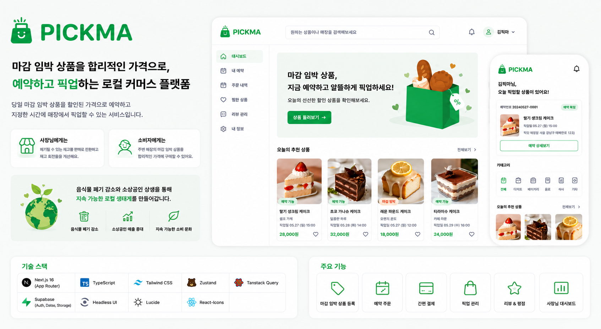
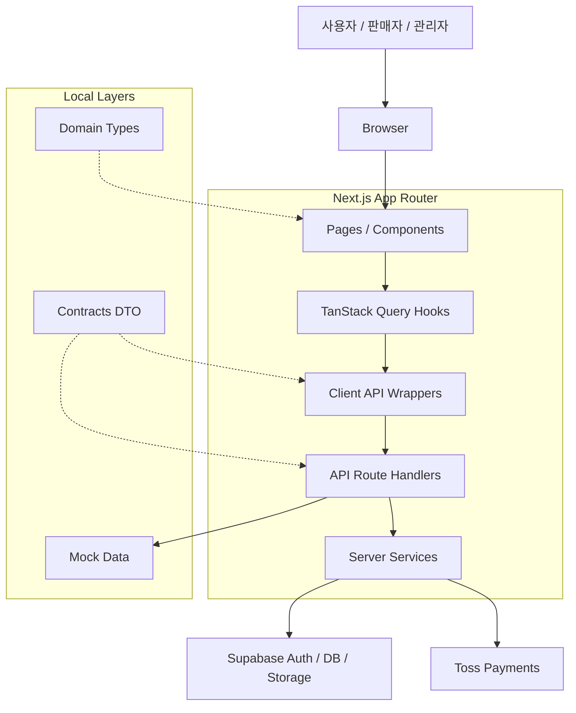

<p align="center">
  
</p>

<h1 align="center">PICKMA</h1>

<p align="center">
  당일 마감 임박 상품을 할인된 가격으로 예약하고 픽업할 수 있는 로컬 커머스 플랫폼
</p>

---

PICKMA는 영업 종료 전 남을 가능성이 있는 음식을 소비자가 할인된 가격으로 예약하고, 지정한 시간에 매장에서 픽업할 수 있도록 돕는 서비스입니다.

판매자는 폐기될 수 있는 재고를 판매로 전환하고, 소비자는 주변 매장의 마감 임박 상품을 합리적인 가격에 구매할 수 있습니다. 서비스의 핵심 목표는 단순 할인 판매가 아니라 **음식물 폐기 감소와 소상공인 재고 회전율 개선**을 함께 해결하는 것입니다.

---

## 👥 PICKMA FE Developers

<table>
  <tr>
    <td align="center">
      <strong>김지웅 (팀장)</strong><br />
      <a href="https://github.com/JiWoongE">
        
      </a><br />
      <a href="https://github.com/JiWoongE">@JiWoongE</a>
    </td>
    <td align="center">
      <strong>김민교</strong><br />
      <a href="https://github.com/DrCloy">
        
      </a><br />
      <a href="https://github.com/DrCloy">@DrCloy</a>
    </td>
    <td align="center">
      <strong>강이슬</strong><br />
      <a href="https://github.com/dew2314">
        
      </a><br />
      <a href="https://github.com/dew2314">@dew2314</a>
    </td>
  </tr>
</table>

---

## 🚀 주요 기능

### 👤 소비자

- 위치 기반 주변 매장 및 마감 임박 상품 조회 (지도 탐색 포함)
- 카테고리·할인율·거리순 필터 및 정렬
- 키워드 상품 검색
- 상품 예약 및 Toss Payments 결제
- 주문 취소 및 환불
- 주문 내역 및 마이페이지 (프로필 수정)

### 🏪 판매자

- 가게 등록 및 운영 상태 관리
- 메뉴·상품 등록 및 수정
- 주문 목록 및 상세 관리
- 판매자 신청 서류 제출 및 KYC 처리
- 판매자 대시보드 (주문 현황)

### 🛠 관리자

- 판매자 신청 승인/반려
- 가게 목록 및 상태 관리
- 사용자·상품·주문 관리
- 대시보드 통계

### ⚙️ 시스템

- 결제 outbox / webhook / idempotency 보장
- 실시간 알림 (Supabase Realtime 기반)
- Storage orphan 정리 Cron (Vercel)
- CI 자동화 (lint, test, build)
- 모바일 앱 래핑 (Capacitor / PWA, 진행 중)

---

## 🛠 기술 스택

| 분류                | 기술                                                                                                                                                                                                                                                                                                                             | 선정 이유                                                                            |
| ------------------- | -------------------------------------------------------------------------------------------------------------------------------------------------------------------------------------------------------------------------------------------------------------------------------------------------------------------------------- | ------------------------------------------------------------------------------------ |
| Framework           |                                                                                                                      | App Router 기반 SSR/RSC로 초기 로딩 최적화, 파일 시스템 라우팅으로 팀 간 충돌 최소화 |
| Language            |                                                                                                                                                                                                                   | strict 모드로 도메인 타입 안정성 확보                                                |
| Styling             |                                                                                                                                                                                                              | 유틸리티 기반으로 빠른 UI 반복, 일관된 디자인 시스템 유지                            |
| UI / A11y           |                                                                                                                                   | 접근성이 필요한 복잡한 UI 패턴을 WAI-ARIA 준수하여 구현                              |
| Server State        |                                                                                                                                                                                                           | 서버 상태 캐싱·동기화·invalidation을 선언적으로 관리                                 |
| Client State        |                                                                                                                                                                                                                                                         | 최소 보일러플레이트로 UI 전역 상태 관리                                              |
| Form / Validation   |                                                                                                            | 비제어 컴포넌트 기반 성능 최적화, 런타임 스키마 검증                                 |
| Auth / DB / Storage |                                                                                                                                                                                                                         | Auth·Postgres·Realtime·Storage를 단일 플랫폼으로 통합                                |
| Payment             |                                                                                                                                                                                                                                             | 국내 결제 환경에 최적화된 SDK, 팝업 기반 결제 흐름                                   |
| Infra               |                                                                                                                                                                                                                               | Next.js와 통합 배포, Cron으로 Storage orphan 정리 자동화                             |
| Mobile              |                                                                                                                                                                                                                      | 웹 코드베이스 재사용으로 네이티브 앱 빌드 (진행 중)                                  |
| Test                |    | 단위·E2E·컴포넌트 테스트 레이어 분리                                                 |
| Quality             |                                                 | 커밋 시점 자동 교정으로 CI·로컬 환경 일치                                            |

---

## 🗄 데이터베이스

> 상세 스키마는 [`docs/erd.md`](docs/erd.md)를 참고합니다.

| 테이블                       | 설명                          |
| ---------------------------- | ----------------------------- |
| users                        | 서비스 유저 프로필            |
| social_accounts              | OAuth 소셜 계정 연동 정보     |
| stores                       | 판매자 가게 정보 및 운영 상태 |
| seller_applications          | 판매자 신청 및 심사 상태      |
| seller_application_documents | 판매자 신청 첨부 서류         |
| categories                   | 상품 카테고리                 |
| menu_items                   | 가게 메뉴 항목                |
| products                     | 마감 임박 할인 상품           |
| product_view_events          | 상품 조회 이벤트 로그         |
| orders                       | 주문 정보                     |
| order_items                  | 주문 상품 항목                |
| store_order_sequences        | 가게별 주문 번호 시퀀스       |
| payments                     | 결제 정보                     |
| payment_events               | 결제 outbox 이벤트            |
| wishlists                    | 소비자 찜 목록                |

---

## ⚙️ 설치 및 실행

### 설치

```bash
npm install
```

### 환경 변수 설정

```bash
cp .env.example .env.local
```

`.env.local`에 Supabase, Toss Payments 등 로컬 실행에 필요한 값을 설정합니다.

### 개발 서버 실행

```bash
npm run dev
```

[http://localhost:3000](http://localhost:3000)에서 확인할 수 있습니다.

### 품질 확인

```bash
npm run lint
npm run test
npm run storybook
```

## 시스템 구조



## 프로젝트 구조

```txt
.
├─ public
│  └─ images                    # 배너, 상품, fallback 이미지
├─ docs                         # API 명세 및 프로젝트 문서
src
├─ app
│  ├─ (consumer)                # 소비자 화면: 메인, 상품 상세, 검색, 주문/결제, 마이페이지
│  ├─ (seller)                  # 판매자 화면: 온보딩, 대시보드, 가게, 메뉴, 상품, 주문 관리
│  ├─ (admin)                   # 관리자 화면: 대시보드, 판매자 승인, 가게·사용자·주문 관리
│  ├─ api
│  │  ├─ products               # 상품 목록/상세/검색 API
│  │  ├─ categories             # 카테고리 API
│  │  ├─ orders                 # 주문 생성/목록/상세/취소 API
│  │  ├─ payments               # 결제 준비/승인/webhook API
│  │  ├─ notifications          # 실시간 알림 API
│  │  ├─ seller                 # 판매자 전용 API
│  │  └─ admin                  # 관리자 전용 API
│  ├─ auth                      # 인증 관련 페이지
│  └─ payment                   # Toss Payments 팝업 checkout/success/fail 페이지
├─ api
│  ├─ products                  # 상품 API client, mapper
│  ├─ categories                # 카테고리 API client
│  ├─ orders                    # 주문 API client, mapper
│  ├─ payments                  # 결제 API client
│  ├─ seller                    # 판매자 API client
│  ├─ admin                     # 관리자 API client
│  └─ users                     # 사용자 API client
├─ components
│  ├─ common                    # Button, Modal, Header, Pagination 등 공통 UI
│  ├─ auth                      # 로그인/회원가입 모달
│  ├─ consumer                  # 소비자 도메인 컴포넌트
│  │  ├─ order                  # 주문/결제 화면 컴포넌트
│  │  ├─ search                 # 검색 결과 컴포넌트
│  │  └─ mypage                 # 마이페이지 컴포넌트
│  ├─ seller                    # 판매자 도메인 컴포넌트
│  ├─ admin                     # 관리자 도메인 컴포넌트
│  └─ dev                       # 개발 확인용 컴포넌트 (dev-only guard 적용)
├─ contracts                    # API 요청/응답 DTO
├─ hooks
│  ├─ products                  # useProducts, useProduct
│  ├─ categories                # useCategories
│  ├─ orders                    # useOrders, useOrder, useCreateOrder, useCancelOrder
│  ├─ payments                  # usePayment
│  ├─ users                     # useMe
│  ├─ notifications             # useNotifications (Supabase Realtime)
│  ├─ seller                    # 판매자 기능 hook
│  └─ admin                     # 관리자 기능 hook
├─ lib
│  ├─ supabase                  # client/server/service/proxy Supabase client
│  ├─ errors                    # 공통 에러 코드 및 메시지
│  └─ ...                       # 시간 포맷, pickup slot, 기타 유틸
├─ mocks                        # API_MOCK_ENABLED=true에서 사용하는 mock 데이터
├─ stores                       # Zustand 기반 UI 상태
├─ tests                        # 테스트 유틸
└─ types                        # 앱 내부 Domain Type
```

## 🔮 향후 계획

- 모바일: Capacitor / PWA 래핑 마무리, i18n 기본 설정 (한국어)
- 소비자: 찜 목록, 위치·검색 기능 확장, 알림 센터 UI
- 관리자: 가게 상태 변경 API, 관리자 운영 알람
- 도메인 확장: 리뷰/평점, 쿠폰/포인트, 공지사항
- 보안/품질: 파일 업로드 MIME·크기 검증, Route Handler 테스트 보강
- 기술 부채: AppError 리팩터링, Supabase 쿼리 반환 타입 안전성 개선
- E2E: 결제 팝업 모킹 전략 수립 및 CI 연동

## 📏 개발 규칙

- 커밋 메시지는 [Conventional Commits](https://www.conventionalcommits.org/)를 사용합니다.
- 공통 UI는 `src/components/common` 컴포넌트를 우선 사용합니다.
- API DTO는 `src/contracts`, 앱 내부 모델은 `src/types`에 둡니다.
- 인라인 스타일보다 Tailwind CSS 유틸리티 클래스를 사용합니다.
- 접근성이 필요한 복잡한 UI 패턴은 Headless UI 사용을 우선합니다.
- mock import는 `API_MOCK_ENABLED=true` 환경에서만 허용합니다.
- 로컬 개발 환경에서 Toss Payments 키가 없을 때는 `PAYMENT_MOCK=true`로 결제 도메인 모킹을 사용합니다.
- 스키마 변경이 포함된 작업은 `docs/migration_policy.md`를 먼저 확인합니다.
