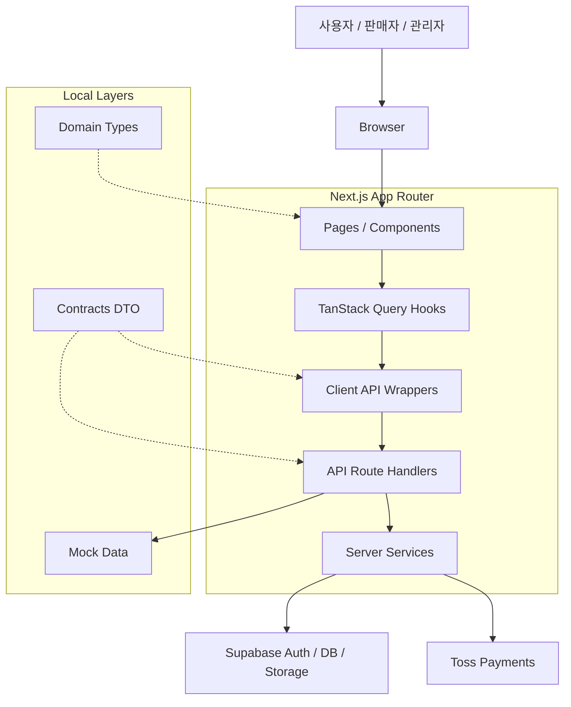

<p align="center">
  
</p>

# PICKMA

> 당일 마감 임박 상품을 할인된 가격으로 예약하고 픽업할 수 있는 로컬 커머스 플랫폼

PICKMA는 영업 종료 전 남을 가능성이 있는 음식을 소비자가 할인된 가격으로 예약하고, 지정한 시간에 매장에서 픽업할 수 있도록 돕는 서비스입니다.

판매자는 폐기될 수 있는 재고를 판매로 전환하고, 소비자는 주변 매장의 마감 임박 상품을 합리적인 가격에 구매할 수 있습니다. 서비스의 핵심 목표는 단순 할인 판매가 아니라 **음식물 폐기 감소와 소상공인 재고 회전율 개선**을 함께 해결하는 것입니다.

## 서비스 이미지

<p align="center">
  
</p>

## PICKMA FE Developers

<table>
  <tr>
    <td align="center">
      <strong>김지웅 (팀장)</strong><br />
      <a href="https://github.com/JiWoongE">
        
      </a><br />
      <a href="https://github.com/JiWoongE">@JiWoongE</a>
    </td>
    <td align="center">
      <strong>김민교</strong><br />
      <a href="https://github.com/DrCloy">
        
      </a><br />
      <a href="https://github.com/DrCloy">@DrCloy</a>
    </td>
    <td align="center">
      <strong>강이슬</strong><br />
      <a href="https://github.com/dew2314">
        
      </a><br />
      <a href="https://github.com/dew2314">@dew2314</a>
    </td>
  </tr>
</table>

## 기술 스택

| 분류                | 기술                                             |
| ------------------- | ------------------------------------------------ |
| Framework           | Next.js 16, React 19                             |
| Language            | TypeScript                                       |
| Styling             | Tailwind CSS                                     |
| UI / A11y           | Headless UI, lucide-react                        |
| Server State        | TanStack Query                                   |
| Client State        | Zustand                                          |
| Form / Validation   | React Hook Form, Zod                             |
| Auth / DB / Storage | Supabase                                         |
| Payment             | Toss Payments SDK                                |
| Test                | Vitest, Playwright, Storybook                    |
| Quality             | ESLint, Prettier, Husky, lint-staged, Commitlint |

## 설치 및 실행

### 설치

```bash
npm install
```

### 환경 변수 설정

```bash
cp .env.example .env.local
```

`.env.local`에 Supabase, Toss Payments 등 로컬 실행에 필요한 값을 설정합니다.

### 개발 서버 실행

```bash
npm run dev
```

[http://localhost:3000](http://localhost:3000)에서 확인할 수 있습니다.

### 품질 확인

```bash
npm run lint
npm run test
npm run storybook
```

## 시스템 구조



## 프로젝트 구조

```txt
.
├─ public
│  └─ images                    # 배너, 상품, fallback 이미지
├─ docs                         # API 명세 및 프로젝트 문서
src
├─ app
│  ├─ (consumer)                # 소비자 화면: 메인, 상품 상세, 주문/결제, 마이페이지
│  ├─ (seller)                  # 판매자 화면: 온보딩, 가게, 메뉴, 상품, 주문 관리
│  ├─ (admin)                   # 관리자 화면
│  ├─ api                       # Next.js Route Handler
│  │  ├─ products               # 상품 목록/상세 API
│  │  ├─ categories             # 카테고리 API
│  │  ├─ orders                 # 주문 생성/목록/상세 API
│  │  ├─ payments               # 결제 준비/승인 API
│  │  ├─ seller                 # 판매자 전용 API
│  │  └─ admin                  # 관리자 전용 API
│  ├─ auth                      # 인증 관련 페이지
│  └─ payment                   # Toss Payments 팝업 checkout/success/fail 페이지
├─ api
│  ├─ products                  # 상품 API client, mapper
│  ├─ categories                # 카테고리 API client
│  ├─ orders                    # 주문 API client, mapper
│  ├─ payments                  # 결제 API client
│  ├─ seller                    # 판매자 API client
│  ├─ admin                     # 관리자 API client
│  └─ users                     # 사용자 API client
├─ components
│  ├─ common                    # Button, Modal, Header, Pagination 등 공통 UI
│  ├─ auth                      # 로그인/회원가입 모달
│  ├─ consumer                  # 소비자 도메인 컴포넌트
│  │  ├─ order                  # 주문/결제 화면 컴포넌트
│  │  └─ mypage                 # 마이페이지 컴포넌트
│  └─ dev                       # 개발 확인용 컴포넌트
├─ contracts                    # API 요청/응답 DTO
├─ hooks
│  ├─ products                  # useProducts, useProduct
│  ├─ categories                # useCategories
│  ├─ orders                    # useOrders, useOrder, useCreateOrder
│  ├─ payments                  # usePayment
│  ├─ users                     # useMe
│  ├─ seller                    # 판매자 기능 hook
│  └─ admin                     # 관리자 기능 hook
├─ lib
│  ├─ supabase                  # client/server/service/proxy Supabase client
│  ├─ errors                    # 공통 에러 코드 및 메시지
│  └─ ...                       # 시간 포맷, pickup slot, 기타 유틸
├─ mocks                        # API_MOCK_ENABLED=true에서 사용하는 mock 데이터
├─ stores                       # Zustand 기반 UI 상태
├─ tests                        # 테스트 유틸
└─ types                        # 앱 내부 Domain Type
```

## 향후 계획

- 모바일 필터 Drawer 및 모바일 주문/마이페이지 UX 개선
- 검색 결과 페이지 및 필터 URL query 동기화
- 현재 위치 기반 상품 조회 및 지도 기반 탐색
- 예약 취소/환불 플로우
- 결제 웹훅 기반 상태 동기화
- 판매자 주문 알림 및 분석 리포트
- 관리자 대시보드 및 승인 관리 UI
- E2E 테스트와 CI/CD 자동화
- AI 추천, 실시간 알림, 리뷰/평점, 쿠폰/포인트 시스템

## 개발 규칙

- 커밋 메시지는 Conventional Commits를 사용합니다.
- 공통 UI는 `src/components/common` 컴포넌트를 우선 사용합니다.
- API DTO는 `src/contracts`, 앱 내부 모델은 `src/types`에 둡니다.
- 인라인 스타일보다 Tailwind CSS 유틸리티 클래스를 사용합니다.
- 접근성이 필요한 복잡한 UI 패턴은 Headless UI 사용을 우선합니다.
