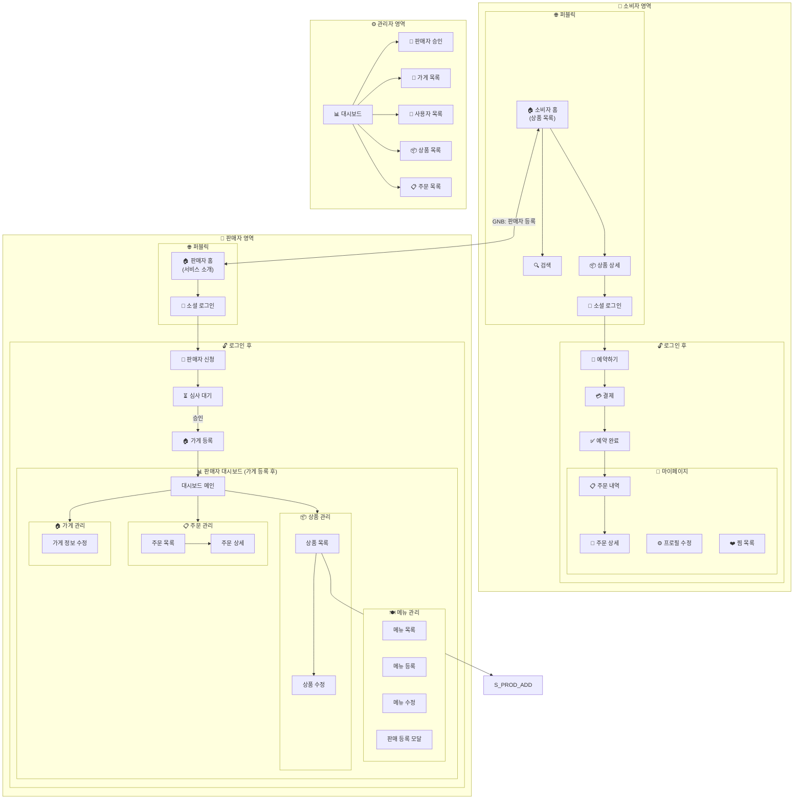

# 1. 사이트맵 개요

```
픽마 (PickMa)
├── 🌐 퍼블릭 영역 (비로그인)
├── 👤 일반 사용자 영역
├── 🏪 판매자 영역
└── ⚙️ 관리자 영역
```

# 2. 상세 사이트맵

## 구현 상태 범례

| 상태      | 기준                                                                                          |
| --------- | --------------------------------------------------------------------------------------------- |
| ✅ 구현됨 | 페이지/UI가 구현됨. mock 데이터 사용 여부와 무관하며, real API 연결은 담당 task에서 별도 추적 |
| 🚧 미구현 | 경로 파일 없거나 placeholder만 존재 (기능 없음). 담당 task ID 병기                            |

## 2.1 소비자 영역 (`/`)

> 로그인은 전역 모달 방식으로 처리하며 별도 URL이 없다.

| Depth 1       | Depth 2    | URL                      | 설명                            | 권한   | 구현 상태       |
| ------------- | ---------- | ------------------------ | ------------------------------- | ------ | --------------- |
| 🏠 소비자 홈  | -          | `/`                      | 상품 목록, 필터, 검색           | 전체   | ✅ 구현됨       |
| 🔍 검색       | -          | `/search`                | 상품 검색 결과                  | 전체   | ✅ 완료 (T56)   |
| 📦 상품 상세  | -          | `/products/[productId]`  | 상품 정보, 가게 정보            | 전체   | ✅ 구현됨       |
| 🛒 예약하기   | -          | `/order/[productId]`     | 수량 선택, 픽업 시간 확정       | 로그인 | ✅ 구현됨       |
| 💳 결제       | -          | `/payment/toss-checkout` | Toss 결제 위젯                  | 로그인 | ✅ 구현됨       |
|               |            | `/payment/success`       | 결제 성공 처리                  | 로그인 | ✅ 구현됨       |
|               |            | `/payment/fail`          | 결제 실패 처리                  | 로그인 | ✅ 구현됨       |
| ✅ 예약 완료  | -          | `/order/complete`        | 예약 완료 안내                  | 로그인 | ✅ 구현됨       |
| ❌ 예약 실패  | -          | `/order/fail`            | 예약 실패/취소 안내             | 로그인 | ✅ 구현됨       |
| 🔑 비밀번호   | -          | `/auth/reset-password`   | 이메일 비밀번호 재설정          | 전체   | ✅ 구현됨       |
| 📄 법적 고지  | 이용약관   | `/terms`                 | 서비스 이용약관                 | 전체   | ✅ 완료 (T42)   |
|               | 개인정보   | `/privacy-policy`        | 개인정보처리방침                | 전체   | ✅ 완료 (T42)   |
| 👤 마이페이지 | -          | `/mypage`                | 내 정보 기본 화면               | 로그인 | ✅ 구현됨       |
|               | 📋 내 예약 | `/mypage/orders`         | 주문 목록, 예약 상세, 픽업 정보 | 로그인 | ✅ 구현됨 (T54) |
|               | ❤️ 찜 목록 | `/mypage/wishlist`       | 관심 가게 (상품 찜은 후속 task) | 로그인 | 🚧 미구현 (T59) |

## 2.2 판매자 영역 (`/seller`)

> 로그인은 전역 모달 방식으로 처리하며 별도 URL이 없다.
>
> `/seller`는 판매자 랜딩/온보딩 CTA 페이지, `/seller/dashboard`는 승인된 판매자 대시보드다.
> 후속 IA 결정에서 `/seller/dashboard`가 `/seller`로 통합될 수 있음 — 확인 필요.

| Depth 1        | Depth 2   | URL                          | 설명                         | 권한        | 구현 상태       |
| -------------- | --------- | ---------------------------- | ---------------------------- | ----------- | --------------- |
| 🏠 판매자 홈   | -         | `/seller`                    | 서비스 소개, 등록 유도 (CTA) | 전체        | 🚧 미구현 (T38) |
| 📝 판매자 신청 | -         | `/seller/register`           | 사업자 정보 + 서류 제출      | 로그인      | ✅ 구현됨       |
| ⏳ 심사 대기   | -         | `/seller/pending`            | 판매자 심사 상태 확인        | 신청자      | ✅ 구현됨       |
| 📊 대시보드    | -         | `/seller/dashboard`          | 오늘의 주문 현황             | 판매자+가게 | ✅ 구현됨 (T51) |
| 🍽️ 메뉴 관리   | -         | `/seller/menu`               | 메뉴 목록, 판매 등록         | 판매자+가게 | ✅ 구현됨       |
|                | 메뉴 등록 | `/seller/menu/new`           | 새 메뉴 등록                 | 판매자+가게 | ✅ 구현됨       |
|                | 메뉴 수정 | `/seller/menu/[menuId]/edit` | 메뉴 정보 수정               | 판매자+가게 | ✅ 구현됨       |
| 📦 상품 관리   | -         | `/seller/products`           | 상품 목록                    | 판매자+가게 | ✅ 구현됨       |
|                | 상품 수정 | `/seller/products/[id]/edit` | 상품 정보 수정               | 판매자+가게 | 🚧 미구현 (T28) |
| 📋 주문 관리   | -         | `/seller/orders`             | 주문 목록                    | 판매자+가게 | ✅ 구현됨       |
|                | 주문 상세 | `/seller/orders/[id]`        | 주문 상세, 픽업 처리         | 판매자+가게 | ✅ 구현됨       |
| 🏠 가게 관리   | -         | `/seller/store`              | 가게 등록/정보               | 판매자      | ✅ 구현됨       |
|                | 정보 수정 | `/seller/store` (모달)       | 가게 정보 수정 (모달 방식)   | 판매자+가게 | ✅ 구현됨       |

## 2.3 관리자 영역 (`/admin`)

| Depth 1        | Depth 2   | URL                      | 설명                  | 권한   | 구현 상태       |
| -------------- | --------- | ------------------------ | --------------------- | ------ | --------------- |
| 📊 대시보드    | -         | `/admin`                 | 관리자 메뉴 허브      | 관리자 | 🚧 미구현 (T58) |
| 🧾 판매자 승인 | -         | `/admin/sellers/pending` | 판매자 신청 승인/거절 | 관리자 | 🚧 미구현 (T03) |
| 🏪 가게 관리   | -         | `/admin/stores`          | 전체 가게 목록        | 관리자 | 🚧 미구현 (T04) |
|                | 가게 상세 | `/admin/stores/[id]`     | 가게 상세 조회        | 관리자 | 🚧 미구현 (T04) |
| 👥 사용자 관리 | -         | `/admin/users`           | 사용자 목록           | 관리자 | 🚧 미구현 (T57) |
| 📦 상품 관리   | -         | `/admin/products`        | 전체 상품 목록        | 관리자 | 🚧 미구현 (T57) |
| 📋 주문 관리   | -         | `/admin/orders`          | 전체 주문 목록        | 관리자 | 🚧 미구현 (T57) |

---

# 3. 주요 사용자 플로우

## 3.1 소비자 - 상품 예약 플로우

```
[소비자 홈] → [상품 상세] → [로그인] → [예약하기] → [결제] → [예약 완료]
│
├── 지역 필터
├── 카테고리 필터
└── 검색
```

## 3.2 판매자 등록 플로우

```
[소비자 홈] ──"판매자 등록"──→ [판매자 홈] → [로그인] → [판매자 신청] → [심사 대기] → [가게 등록] → [대시보드]
(서비스 소개)
```

## 3.3 판매자 - 상품 등록 플로우

```
[대시보드] → [메뉴 관리] → [판매 등록 모달] → [등록 완료]
│
├── 메뉴 선택
├── 판매가
├── 수량
├── 판매 마감 일시
└── 픽업 시간대
```

## 3.4 판매자 - 픽업 처리 플로우

```
[대시보드] → [주문 관리] → [주문 상세]
                              │
                              ├── [접수 처리] → 접수 대기(reserved) → 준비 중(accepted)
                              ├── [준비 완료] → 준비 중(accepted) → 준비완료(ready)
                              ├── [픽업 완료] → 준비완료(ready) → 픽업완료(completed)
                              └── [노쇼 처리]
```

## 3.5 관리자 - 판매자 승인 플로우

```text
[대시보드] → [판매자 승인] → [판매자 신청 목록] → [신청 상세/서류 확인] → [승인/거절]
```

---

# 4. 접근 권한 매트릭스

### 4.1 소비자 영역 (`/`)

| 페이지     | 비로그인 | 로그인 사용자 |
| ---------- | -------- | ------------- |
| 소비자 홈  | ✅       | ✅            |
| 상품 상세  | ✅       | ✅            |
| 검색       | ✅       | ✅            |
| 이용약관   | ✅       | ✅            |
| 개인정보   | ✅       | ✅            |
| 예약/결제  | ❌       | ✅            |
| 마이페이지 | ❌       | ✅            |

### 4.2 판매자 영역 (`/seller`)

| 페이지              | 비로그인 | 로그인 | 신청자 | 승인된 판매자 | 판매자+가게 |
| ------------------- | -------- | ------ | ------ | ------------- | ----------- |
| 판매자 홈 (소개)    | ✅       | ✅     | ✅     | ✅            | ✅          |
| 판매자 신청         | ❌       | ✅     | ❌     | ❌            | ❌          |
| 심사 대기           | ❌       | ❌     | ✅     | ❌            | ❌          |
| 가게 등록           | ❌       | ❌     | ❌     | ✅            | ❌          |
| 대시보드            | ❌       | ❌     | ❌     | ❌            | ✅          |
| 상품/주문/가게 관리 | ❌       | ❌     | ❌     | ❌            | ✅          |

### 4.3 관리자 영역 (`/admin`)

| 페이지      | 관리자 | 그 외 |
| ----------- | ------ | ----- |
| 모든 페이지 | ✅     | ❌    |

---

# 5. URL 구조 요약

```
소비자 영역
/ ............................ 소비자 홈 (상품 목록)
/search ...................... 상품 검색 결과
/products/[productId] ........ 상품 상세
/order/[productId] ........... 예약하기
/payment/toss-checkout ....... Toss 결제 위젯
/payment/success ............. 결제 성공 처리
/payment/fail ................ 결제 실패 처리
/order/complete .............. 예약 완료 안내
/order/fail .................. 예약 실패/취소 안내
/auth/reset-password ......... 이메일 비밀번호 재설정
/terms ....................... 이용약관
/privacy-policy .............. 개인정보처리방침
/mypage ...................... 내 정보 기본 화면
/mypage/orders ............... 내 예약/주문 내역
/mypage/wishlist ............. 찜 목록 [🚧 T59]
(로그인) .................... 전역 모달 — 별도 URL 없음

판매자 영역
/seller ...................... 판매자 홈/온보딩 CTA [🚧 T38]
/seller/register ............. 판매자 신청
/seller/pending .............. 심사 대기
/seller/dashboard ............ 대시보드
/seller/menu ................. 메뉴 목록, 판매 등록
/seller/menu/new ............. 메뉴 등록
/seller/menu/[menuId]/edit ... 메뉴 수정
/seller/products ............. 상품 목록
/seller/products/[id]/edit ... 상품 수정 [🚧 T28]
/seller/orders ............... 주문 목록
/seller/orders/[id] .......... 주문 상세
/seller/store ................ 가게 정보
(로그인) .................... 전역 모달 — 별도 URL 없음

관리자 영역
/admin ....................... 관리자 메뉴 허브 [🚧 T58]
/admin/sellers/pending ....... 판매자 신청 승인 [🚧 T03]
/admin/stores ................ 가게 목록 [🚧 T04]
/admin/stores/[id] ........... 가게 상세 조회 [🚧 T04]
/admin/users ................. 사용자 목록 [🚧 T57]
/admin/products .............. 상품 목록 [🚧 T57]
/admin/orders ................ 주문 목록 [🚧 T57]
```

---

# 6. 네비게이션 구조

## 6.1 소비자 홈 GNB

```
┌─────────────────────────────────────────────────────────────────┐
│ [로고]  [홈]  [검색]  ············  [판매자 등록]  [마이페이지]  [로그인] │
└─────────────────────────────────────────────────────────────────┘
```

| 요소            | 비로그인       | 로그인         |
| --------------- | -------------- | -------------- |
| 로고            | ✅ → `/`       | ✅ → `/`       |
| 홈              | ✅             | ✅             |
| 검색            | ✅             | ✅             |
| **판매자 등록** | ✅ → `/seller` | ✅ → `/seller` |
| 마이페이지      | ❌             | ✅             |
| 로그인/프로필   | 로그인         | 프로필         |

## 6.2 판매자 홈 GNB (비로그인 / 미승인)

```
┌─────────────────────────────────────────────────────────────────┐
│ [로고]  ······························ [소비자 홈]  [로그인/가게 등록] │
└─────────────────────────────────────────────────────────────────┘
```

## 6.3 판매자 대시보드 GNB (승인된 판매자)

```
┌─────────────────────────────────────────────────────────────────────────┐
│ [로고]  [대시보드]  [상품 관리]  [주문 관리]  [가게 관리]  ···  [소비자 홈]  [프로필] │
└─────────────────────────────────────────────────────────────────────────┘
```

## 6.4 관리자 GNB

```
┌─────────────────────────────────────────────────────────────────────┐
│ [로고]  [대시보드]  [가게 관리]  [사용자]  [상품]  [주문]  ·········  [프로필] │
└─────────────────────────────────────────────────────────────────────┘
```

---

# 7. 모바일 네비게이션 (Bottom Tab)

## 7.1 소비자 홈 - Bottom Tab

```
┌─────────────────────────────────────────┐
│  [🏠 홈]    [🔍 검색]    [❤️ 찜]    [👤 MY] │
└─────────────────────────────────────────┘
```

> 상단 햄버거 메뉴 또는 마이페이지에서 **"판매자 등록"** 접근

## 7.2 판매자 대시보드 - Bottom Tab

```
┌─────────────────────────────────────────┐
│  [📊 홈]  [📦 상품]  [📋 주문]  [🏠 가게]    │
└─────────────────────────────────────────┘
```

---

# 8. 로그인 분기 처리

로그인은 전역 모달 방식으로 처리하며 `/login`, `/seller/login` 같은 별도 URL이 없다.

로그인 후 리다이렉트:

- 소비자: `/` (소비자 홈) 또는 이전 페이지로 복귀
- 판매자: 상태에 따라 분기

| 상태                             | 리다이렉트           |
| -------------------------------- | -------------------- |
| 판매자 미신청 / 일반 로그인      | `/seller` (랜딩 CTA) |
| 신청 후 심사 대기중              | `/seller/pending`    |
| 승인 완료 + 가게 없음            | `/seller/store`      |
| 승인 완료 + 가게 있음 (대시보드) | `/seller/dashboard`  |

---

# 9. 다이어그램


