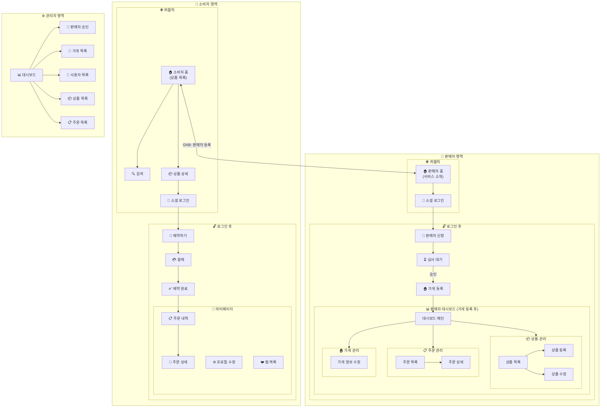

# 1. 사이트맵 개요

```
픽마 (PickMa)
├── 🌐 퍼블릭 영역 (비로그인)
├── 👤 일반 사용자 영역
├── 🏪 판매자 영역
└── ⚙️ 관리자 영역
```

# 2. 상세 사이트맵

## 2.1 소비자 영역 (`/`)

| Depth 1       | Depth 2        | URL                   | 설명                        | 권한     |
| ------------- | -------------- | --------------------- | --------------------------- | -------- |
| 🏠 소비자 홈  | -              | `/`                   | 상품 목록, 필터, 검색       | 전체     |
| 🔍 검색       | -              | `/search`             | 상품/가게 검색 결과         | 전체     |
| 📦 상품 상세  | -              | `/products/[id]`      | 상품 정보, 가게 정보        | 전체     |
| 🔐 로그인     | -              | `/login`              | 소셜 로그인 (Google, Kakao) | 비로그인 |
| 🛒 예약하기   | -              | `/order/[productId]`  | 수량 선택, 픽업 시간 확정   | 로그인   |
| 💳 결제       | -              | `/payment`            | PG 결제 진행                | 로그인   |
| ✅ 예약 완료  | -              | `/order/complete`     | 예약 완료 안내              | 로그인   |
| 👤 마이페이지 | -              | `/mypage`             | 마이페이지 메인             | 로그인   |
|               | 📋 주문 내역   | `/mypage/orders`      | 주문 목록                   | 로그인   |
|               | 📄 주문 상세   | `/mypage/orders/[id]` | 주문 상세, 픽업 정보        | 로그인   |
|               | ⚙️ 프로필 수정 | `/mypage/profile`     | 닉네임, 연락처 수정         | 로그인   |
|               | ❤️ 찜 목록     | `/mypage/wishlist`    | 관심 가게/상품              | 로그인   |

## 2.2 판매자 영역 (`/seller`)

| Depth 1        | Depth 2   | URL                          | 설명                        | 권한        |
| -------------- | --------- | ---------------------------- | --------------------------- | ----------- |
| 🏠 판매자 홈   | -         | `/seller`                    | 서비스 소개, 등록 유도      | 전체        |
| 🔐 로그인      | -         | (전역 로그인 모달)           | 소셜 로그인 (Google, Kakao) | 비로그인    |
| 📝 판매자 신청 | -         | `/seller/register`           | 사업자 정보 + 서류 제출     | 로그인      |
| ⏳ 심사 대기   | -         | `/seller/pending`            | 판매자 심사 상태 확인       | 신청자      |
| 📊 대시보드    | -         | `/seller/dashboard`          | 오늘의 주문 현황            | 판매자+가게 |
| 📦 상품 관리   | -         | `/seller/products`           | 상품 목록                   | 판매자+가게 |
|                | 상품 등록 | `/seller/products/new`       | 새 상품 등록                | 판매자+가게 |
|                | 상품 수정 | `/seller/products/[id]/edit` | 상품 정보 수정              | 판매자+가게 |
| 📋 주문 관리   | -         | `/seller/orders`             | 주문 목록                   | 판매자+가게 |
|                | 주문 상세 | `/seller/orders/[id]`        | 주문 상세, 픽업 처리        | 판매자+가게 |
| 🏠 가게 관리   | -         | `/seller/store`              | 가게 등록/정보              | 판매자      |
|                | 정보 수정 | `/seller/store/edit`         | 가게 정보 수정              | 판매자+가게 |

## 2.3 관리자 영역 (`/admin`)

| Depth 1        | Depth 2   | URL                      | 설명                  | 권한   |
| -------------- | --------- | ------------------------ | --------------------- | ------ |
| 📊 대시보드    | -         | `/admin`                 | 플랫폼 통계           | 관리자 |
| 🧾 판매자 승인 | -         | `/admin/sellers/pending` | 판매자 신청 승인/거절 | 관리자 |
| 🏪 가게 관리   | -         | `/admin/stores`          | 전체 가게 목록        | 관리자 |
|                | 가게 상세 | `/admin/stores/[id]`     | 가게 상세 조회        | 관리자 |
| 👥 사용자 관리 | -         | `/admin/users`           | 사용자 목록           | 관리자 |
| 📦 상품 관리   | -         | `/admin/products`        | 전체 상품 목록        | 관리자 |
| 📋 주문 관리   | -         | `/admin/orders`          | 전체 주문 목록        | 관리자 |

---

# 3. 주요 사용자 플로우

## 3.1 소비자 - 상품 예약 플로우

```
[소비자 홈] → [상품 상세] → [로그인] → [예약하기] → [결제] → [예약 완료]
│
├── 지역 필터
├── 카테고리 필터
└── 검색
```

## 3.2 판매자 등록 플로우

```
[소비자 홈] ──"판매자 등록"──→ [판매자 홈] → [로그인] → [판매자 신청] → [심사 대기] → [가게 등록] → [대시보드]
(서비스 소개)
```

## 3.3 판매자 - 상품 등록 플로우

```
[대시보드] → [상품 관리] → [상품 등록] → [등록 완료]
│
├── 상품명
├── 원가 / 할인가
├── 수량
├── 마감 시간
└── 픽업 시간대
```

## 3.4 판매자 - 픽업 처리 플로우

```
[대시보드] → [주문 관리] → [주문 상세] → [픽업 완료 처리]
│
└── [노쇼 처리]
```

## 3.5 관리자 - 판매자 승인 플로우

```text
[대시보드] → [판매자 승인] → [판매자 신청 목록] → [신청 상세/서류 확인] → [승인/거절]
```

---

# 4. 접근 권한 매트릭스

### 4.1 소비자 영역 (`/`)

| 페이지     | 비로그인 | 로그인 사용자 |
| ---------- | -------- | ------------- |
| 소비자 홈  | ✅       | ✅            |
| 상품 상세  | ✅       | ✅            |
| 검색       | ✅       | ✅            |
| 예약/결제  | ❌       | ✅            |
| 마이페이지 | ❌       | ✅            |

### 4.2 판매자 영역 (`/seller`)

| 페이지              | 비로그인 | 로그인 | 신청자 | 승인된 판매자 | 판매자+가게 |
| ------------------- | -------- | ------ | ------ | ------------- | ----------- |
| 판매자 홈 (소개)    | ✅       | ✅     | ✅     | ✅            | ✅          |
| 판매자 신청         | ❌       | ✅     | ❌     | ❌            | ❌          |
| 심사 대기           | ❌       | ❌     | ✅     | ❌            | ❌          |
| 가게 등록           | ❌       | ❌     | ❌     | ✅            | ❌          |
| 대시보드            | ❌       | ❌     | ❌     | ❌            | ✅          |
| 상품/주문/가게 관리 | ❌       | ❌     | ❌     | ❌            | ✅          |

### 4.3 관리자 영역 (`/admin`)

| 페이지      | 관리자 | 그 외 |
| ----------- | ------ | ----- |
| 모든 페이지 | ✅     | ❌    |

---

# 5. URL 구조 요약

```
소비자 영역
/ ............................ 소비자 홈 (상품 목록)
/search ...................... 검색 결과
/products/[id] ............... 상품 상세
/login ....................... 소셜 로그인
/order/[productId] ........... 예약하기
/payment ..................... 결제
/order/complete .............. 예약 완료
/mypage ...................... 마이페이지
/mypage/orders ............... 주문 내역
/mypage/orders/[id] .......... 주문 상세
/mypage/profile .............. 프로필 수정
/mypage/wishlist ............. 찜 목록

판매자 영역
/seller ...................... 판매자 홈 (서비스 소개)
/seller/login ................ 판매자 로그인
/seller/register ............. 판매자 신청
/seller/pending .............. 심사 대기
/seller/dashboard ............ 대시보드
/seller/products ............. 상품 목록
/seller/products/new ......... 상품 등록
/seller/products/[id]/edit ... 상품 수정
/seller/orders ............... 주문 목록
/seller/orders/[id] .......... 주문 상세
/seller/store ................ 가게 정보
/seller/store/edit ........... 가게 정보 수정

관리자 영역
/admin ....................... 대시보드
/admin/sellers/pending ....... 판매자 신청 승인
/admin/stores ................ 가게 목록
/admin/stores/[id] ........... 가게 상세 조회
/admin/users ................. 사용자 목록
/admin/products .............. 상품 목록
/admin/orders ................ 주문 목록
```

---

# 6. 네비게이션 구조

## 6.1 소비자 홈 GNB

```
┌─────────────────────────────────────────────────────────────────┐
│ [로고]  [홈]  [검색]  ············  [판매자 등록]  [마이페이지]  [로그인] │
└─────────────────────────────────────────────────────────────────┘
```

| 요소            | 비로그인       | 로그인         |
| --------------- | -------------- | -------------- |
| 로고            | ✅ → `/`       | ✅ → `/`       |
| 홈              | ✅             | ✅             |
| 검색            | ✅             | ✅             |
| **판매자 등록** | ✅ → `/seller` | ✅ → `/seller` |
| 마이페이지      | ❌             | ✅             |
| 로그인/프로필   | 로그인         | 프로필         |

## 6.2 판매자 홈 GNB (비로그인 / 미승인)

```
┌─────────────────────────────────────────────────────────────────┐
│ [로고]  ······························ [소비자 홈]  [로그인/가게 등록] │
└─────────────────────────────────────────────────────────────────┘
```

## 6.3 판매자 대시보드 GNB (승인된 판매자)

```
┌─────────────────────────────────────────────────────────────────────────┐
│ [로고]  [대시보드]  [상품 관리]  [주문 관리]  [가게 관리]  ···  [소비자 홈]  [프로필] │
└─────────────────────────────────────────────────────────────────────────┘
```

## 6.4 관리자 GNB

```
┌─────────────────────────────────────────────────────────────────────┐
│ [로고]  [대시보드]  [가게 관리]  [사용자]  [상품]  [주문]  ·········  [프로필] │
└─────────────────────────────────────────────────────────────────────┘
```

---

# 7. 모바일 네비게이션 (Bottom Tab)

## 7.1 소비자 홈 - Bottom Tab

```
┌─────────────────────────────────────────┐
│  [🏠 홈]    [🔍 검색]    [❤️ 찜]    [👤 MY] │
└─────────────────────────────────────────┘
```

> 상단 햄버거 메뉴 또는 마이페이지에서 **"판매자 등록"** 접근

## 7.2 판매자 대시보드 - Bottom Tab

```
┌─────────────────────────────────────────┐
│  [📊 홈]  [📦 상품]  [📋 주문]  [🏠 가게]    │
└─────────────────────────────────────────┘
```

---

# 8. 로그인 분기 처리

- 소비자 로그인 (`/login`)
  - 로그인 후 → `/` (소비자 홈) 또는 이전 페이지
- 판매자 로그인 (`/seller/login`)
  - 로그인 후 상태에 따라 분기:
    | 상태 | 리다이렉트 |
    | ----------- | ------------------- |
    | 가게 미등록 | `/seller/register` |
    | 승인 대기중 | `/seller/pending` |
    | 승인 완료 | `/seller/dashboard` |

---

# 9. 다이어그램


