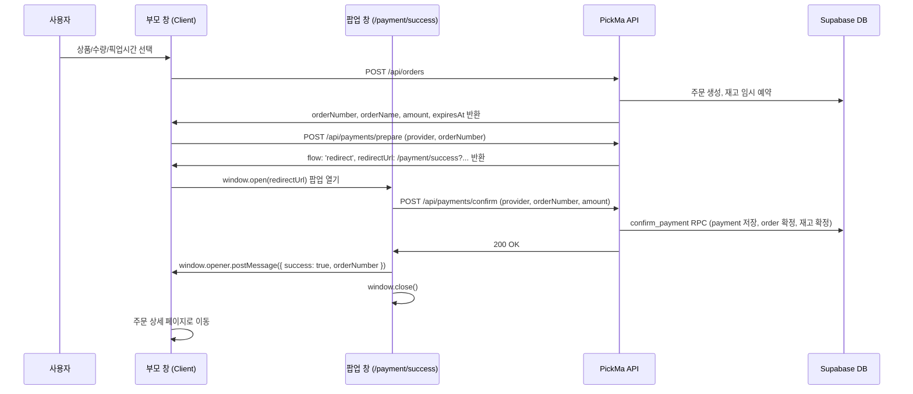

# 시스템 아키텍처

## 1. 기술 스택

| 계층            | 기술                                        | 비고                                     |
| --------------- | ------------------------------------------- | ---------------------------------------- |
| Frontend        | Next.js 16 App Router, React 19, TypeScript | SSR/CSR 혼합                             |
| Styling         | Tailwind CSS, Headless UI                   | UI 구현                                  |
| Client State    | Zustand                                     | UI/클라이언트 상태                       |
| Server State    | TanStack Query                              | API 데이터 캐싱, refetch, mutation       |
| Auth/DB/Storage | Supabase, `@supabase/ssr`                   | Auth, PostgreSQL, Storage                |
| Payment         | Provider adapter 구조 (mock + Toss MVP)     | prepare/confirm 분리, provider별 adapter |
| Deployment      | Vercel                                      | Next.js 배포                             |

---

## 2. 핵심 원칙

- Supabase DB 접근은 클라이언트에서 직접 하지 않고 `src/api` → `src/app/api` Route Handler를 경유한다.
- Supabase Auth는 SDK를 사용하되, 컴포넌트에서 직접 호출하지 않고 `src/api/auth/authApi.ts` 같은 래퍼로 모은다.
- 인증 세션은 `@supabase/ssr` 기반 cookie session 방식을 사용한다.
- Next.js `proxy.ts`는 세션 refresh와 보호 라우트 1차 접근 제어를 담당한다.
- API별 최종 인증, 권한, 리소스 소유권 검증은 Route Handler와 서버 service에서 수행한다.
- Mock/Real 전환은 Route Handler 내부에서 `API_MOCK_ENABLED`로 분기한다.

---

## 3. 전체 데이터 흐름

```text
[ Client ]

Page / Component
  ↓ hook
src/hooks/*
  ↓ domain api
src/api/{domain}/{domain}Api.ts
  ↓ apiClient
src/api/apiClient.ts
  ↓ fetch('/api/...')

[ Server ]

src/app/api/{resource}/route.ts
  ↓ validation/auth/response helpers
src/app/api/_lib/*
  ↓ mock 분기 또는 service 호출
src/mocks/* 또는 src/app/api/{resource}/_lib/service.ts
  ↓ Supabase query
src/lib/supabase/server.ts
  ↓ mapper
src/app/api/{resource}/_lib/mapper.ts
  ↓ contract DTO response
```

---

## 4. 인증과 세션

### 4.1 Supabase Auth 로그인

```text
Client authApi
  -> Supabase Auth SDK
  -> Google/Kakao OAuth 또는 email/password
  -> Supabase callback/session
  -> cookie 기반 세션 저장
```

OAuth 로그인 시작, email/password 회원가입/로그인, 비밀번호 재설정, 로그아웃은 서버 Route Handler가 아니라 Supabase Auth SDK 래퍼에서 처리한다. 컴포넌트는 Supabase SDK를 직접 호출하지 않고 `src/api/auth/authApi.ts`만 사용한다.

회원가입 시 입력한 이름은 Phase 2.5에서 Supabase Auth metadata에만 전달한다. PickMa 서비스 내부 `users` row 보장과 role/status 검증은 Phase 3의 `/api/users/me`와 서버 인증 helper에서 OAuth/email 로그인 모두 동일한 흐름으로 처리한다.

### 4.2 Proxy 역할

`proxy.ts`는 fetch 요청에 `Authorization` 헤더를 자동 주입하지 않는다. 요청 진입 시점에서 쿠키 기반 세션을 확인/갱신하고, 보호 라우트 접근을 1차로 제어한다.

```text
Browser request
  ↓
src/proxy.ts
  - Supabase 세션 refresh
  - 보호 페이지 redirect
  ↓
Page / Route Handler
```

`config.matcher` 권장안은 정적 asset을 제외한 앱 요청 전반에 적용하는 방식이다. 세션 refresh는 넓게 수행하고, 실제 redirect 대상은 proxy 내부 보호 라우트 목록으로 판단한다. 최종 matcher와 보호 라우트 목록은 Phase 1 구현 전에 한 번 더 확정한다.

```ts
export const config = {
  matcher: [
    '/((?!_next/static|_next/image|favicon.ico|robots.txt|sitemap.xml|.*\\.(?:svg|png|jpg|jpeg|gif|webp|ico)$).*)',
  ],
};
```

로그인은 별도 페이지를 두지 않고, 전역 로그인 모달에서 Supabase OAuth 또는 email/password 로그인을 시작한다. 따라서 proxy는 미인증 페이지 접근 시 `/login`으로 보내지 않고 공개 진입점에 `auth=required`와 `next` query를 붙여 redirect한다. 클라이언트는 해당 query를 보고 로그인 모달을 연다.

전역 AuthModal은 `src/app/layout.tsx`에 mount하고, 모달 open/뷰 전환/next 경로는 `src/components/auth/useAuthModal.ts`의 Zustand UI state로 관리한다. Headless UI `Dialog`를 사용하므로 별도 AuthModalProvider는 두지 않는다.

비밀번호 재설정 요청은 Supabase Auth reset flow를 사용한다. reset link 진입점은 `/auth/reset-password`이며, 해당 페이지는 새 비밀번호 저장 시 `authApi.updatePassword()`를 호출한다.

보호 라우트 권장안:

- 공개: `/`, `/search`, `/products/:path*`, `/seller`
- 로그인 필요: `/order/:path*`, `/payment`, `/mypage/:path*`
- 판매자 onboarding 흐름: `/seller/register`, `/seller/pending`은 로그인 사용자를 대상으로 하며, seller application 상태, `users.role`, 내 가게 존재 여부에 따라 seller 영역에서 분기한다.
- 승인된 판매자 필요: `/seller/store/:path*`
- 승인된 판매자와 승인된 가게 필요: `/seller/dashboard/:path*`, `/seller/products/:path*`, `/seller/orders/:path*`
- 관리자 필요: `/admin/:path*`

미인증 redirect 권장안:

- 소비자 보호 라우트: `/?auth=required&next={pathname}`
- 판매자 보호 라우트: `/seller?auth=required&next={pathname}`
- 관리자 보호 라우트: `/?auth=required&next={pathname}`

### 4.3 Supabase client 분리

```text
src/lib/supabase/client.ts   # 브라우저용 Supabase client
src/lib/supabase/server.ts   # Route Handler / Server Component용 Supabase client
src/lib/supabase/proxy.ts    # proxy 세션 refresh용 helper
src/lib/supabase/service.ts  # service_role 서버 전용 client (RLS bypass, 서버 전용)
```

- Supabase browser/server/proxy client는 `@supabase/ssr` 기준으로 구현한다.
- Phase 1에서 패키지를 추가하고, 실제 `proxy.ts`와 server client가 cookie session을 갱신/읽는지 동작 확인한다.

---

## 5. API 레이어 구조

### 5.1 클라이언트 API

```text
src/api/
  apiClient.ts
  auth/
    authApi.ts
  products/
    productApi.ts
    productMapper.ts
  orders/
    orderApi.ts
    orderMapper.ts
  stores/
    storeApi.ts
    storeMapper.ts
  seller-applications/
    sellerApplicationApi.ts
    sellerApplicationMapper.ts
  files/
    fileApi.ts
  users/
    userApi.ts
    userMapper.ts
  seller/
    onboarding/
      sellerOnboardingApi.ts
      sellerOnboardingMapper.ts
    products/
      sellerProductApi.ts
      sellerProductMapper.ts
    orders/
      sellerOrderApi.ts
      sellerOrderMapper.ts
  admin/
    sellers/
      adminSellerApplicationApi.ts
      adminSellerApplicationMapper.ts
    stores/
      adminStoreApi.ts
      adminStoreMapper.ts
    users/
      adminUserApi.ts
      adminUserMapper.ts
    products/
      adminProductApi.ts
      adminProductMapper.ts
    orders/
      adminOrderApi.ts
      adminOrderMapper.ts
```

- `apiClient`는 fetch 래퍼, query string 조립, JSON 파싱, envelope 해석, 공통 에러 변환을 담당한다.
- cookie 기반 세션을 사용하므로 `Authorization: Bearer`를 직접 주입하지 않는다.
- `credentials: 'include'`를 기본 적용한다.
- 성공 시 `envelope.data`만 반환하고, 실패 시 `ApiError`를 throw한다.
- 도메인 API 객체는 단수형으로 둔다. 예: `productApi`, `orderApi`.
- 공개/소비자 API, 판매자 API, 관리자 API는 접근 주체와 반환 데이터가 다르므로 클라이언트 API와 hook도 역할별로 분리한다.
- 파일 업로드는 도메인별 API가 아니라 `files/fileApi.ts` 공통 helper가 signed upload URL 발급과 실제 업로드를 감싼다. 도메인 hook은 파일 helper를 조합해 최종 도메인 API를 호출한다.
- `src/api`와 `src/hooks`는 Phase 1에서 도메인별 barrel export를 만들지 않고 직접 파일 import를 기본으로 한다.
- barrel export는 `src/types/index.ts`, `src/contracts/index.ts`, `src/lib/errors/index.ts`처럼 공통 타입/contract/error에 한정해 사용한다.

### 5.2 서버 Route Handler

```text
src/app/api/
  _lib/
    auth.ts
    response.ts
    validation.ts
  products/
    route.ts
    [productId]/
      route.ts
    _lib/
      service.ts
      mapper.ts
      schemas.ts
```

- `route.ts`는 HTTP method, query/body parsing, 인증 helper 호출, 응답 envelope 생성을 담당한다.
- 도메인 내부 보조 파일은 `src/app/api/{resource}/_lib/`에 둔다.
- `service.ts`는 HTTP 객체를 알지 않고 Supabase query와 비즈니스 로직을 담당한다.
- `mapper.ts`는 Supabase row/join 결과를 contract DTO로 변환한다.
- `schemas.ts`는 해당 도메인 Route Handler의 Zod schema를 담당한다.
- 파일명 앞에 `_`를 붙이지 않고, Next.js private folder인 `_lib/`만 사용한다.

### 5.3 서버 인증/권한 helper

- `requireActiveUser()`: 로그인된 active 사용자 확인.
- `requireAdmin()`: `users.role = 'admin'` 확인.
- `requireSeller()`: `users.role = 'seller'` 확인. 승인된 판매자이지만 아직 가게가 없는 상태를 허용한다.
- `requireSellerStore()`: `requireSeller()` 이후 내 가게 존재와 `stores.status = 'approved'`를 확인한다.

상품/주문처럼 가게 소유권이 필요한 seller API는 `requireSellerStore()`를 사용한다. 가게 등록, seller onboarding 상태 조회처럼 가게가 아직 없을 수 있는 흐름은 `requireSeller()` 또는 `requireActiveUser()`를 사용한다.

판매자 승인은 `seller_applications.status = 'approved'`와 `users.role = 'seller'` 전환을 atomic하게 처리한다. `seller_applications`에는 `reviewed_by`를 저장하지 않고, 관리자 작업자 추적은 후속 감사 로그 도메인에서 다룬다.

---

## 6. 상태 관리

| 대상               | 도구           | 예시                             |
| ------------------ | -------------- | -------------------------------- |
| 서버 상태          | TanStack Query | 상품 목록, 주문 목록, 가게 정보  |
| 클라이언트/UI 상태 | Zustand        | 모달, 임시 선택값, UI preference |

Query key는 route/API 폴더와 맞춰 복수형 도메인명을 사용한다.

```text
['products', 'list', params]
['products', 'detail', productId]
['orders', 'list', params]
['orders', 'detail', orderId]
['stores', 'my']
['users', 'me']
['admin', 'stores', 'list', params]
```

Hook은 하나의 파일에 하나씩 둔다.

```text
src/hooks/products/useProducts.ts
src/hooks/products/useProduct.ts
src/hooks/products/useCreateProduct.ts
src/hooks/seller/products/useSellerProducts.ts
src/hooks/admin/products/useAdminProducts.ts
```

TanStack Query Provider는 `src/app/providers.tsx`에 둔다. `providers.tsx`는 `'use client'` 컴포넌트이며 `src/app/layout.tsx`에서 `<Providers>{children}</Providers>`로 감싼다.

---

## 7. 결제 흐름



- `POST /api/orders`: 주문 생성과 재고 임시 예약. `orderNumber`(PickMa 내부 식별자)를 반환한다.
- `POST /api/payments/prepare`: provider adapter를 통해 결제 시작 정보를 만들고, `flow: 'redirect'`, `redirectUrl`을 반환한다. mock provider는 `/payment/success?orderNumber=...&provider=...&amount=...`를 반환한다. 실제 provider는 외부 결제 창 URL을 반환한다.
- 클라이언트는 `redirectUrl`을 팝업 창(`window.open`)으로 열어 결제 흐름을 진행한다.
- `/payment/success` 페이지: URL 파라미터(`orderNumber`, `provider`, `amount`)를 받아 `POST /api/payments/confirm`을 호출한다. 성공 시 `window.opener.postMessage({ success: true, orderNumber }, window.location.origin)`을 보내고 팝업을 닫는다. 실패 시 `window.opener.postMessage({ success: false }, window.location.origin)`을 보내고 팝업을 닫는다. `targetOrigin`은 항상 명시하며 와일드카드(`'*'`)는 정보 유출 위험으로 사용하지 않는다.
- 부모 창: `message` 이벤트를 수신할 때 `event.origin === window.location.origin` 으로 출처를 엄격하게 검증(`===`)한 뒤, 메시지 구조(`{ success, orderNumber }`)를 확인하고, `success: true`이면 주문 상세 페이지로 이동한다 (프론트 결제 연동 phase에서 구현).
- `POST /api/payments/confirm`: provider adapter를 통해 승인 후, `confirm_payment` DB RPC로 주문을 atomic하게 확정한다.
- provider: 결제 승인 주체 (`toss | kakao_pay | naver_pay`). 실 provider adapter 연결 전까지는 provider 관계없이 mock adapter가 동작한다. MVP 실제 provider adapter는 Toss를 우선 구현한다.
- `orderNumber`는 PickMa 내부 주문 식별자이며, provider별 외부 주문 필드명은 adapter 내부에서만 다룬다.
- `POST /api/payments/webhook`: 결제 상태 동기화용 endpoint. Toss adapter 구현 시 운영 필수성을 재판정하며, 기본 우선순위는 P1이다.
- 주문 생성, 결제 확정, 예약 해제에 따른 재고 변경은 Postgres RPC/transaction으로 atomic하게 처리한다.
- `payment_pending` 주문은 `expiresAt` 이후 `expired`로 전환하고 `reserved_stock`을 복구한다.
- 초기 구현은 API 진입 시 lazy cleanup과 결제 confirm 시점 검사를 사용하고, scheduled job/cron은 MVP 이후 보강한다.

---

## 8. Mock 전략

```env
API_MOCK_ENABLED=true
```

- `NEXT_PUBLIC_`을 붙이지 않는다. Route Handler 서버 영역에서만 읽는다.
- Mock 데이터는 `src/mocks`에 도메인별로 둔다.
- Mock 데이터는 contract DTO 기준으로 작성한다.
- 클라이언트 API, hook, component는 mock/real 여부를 알지 않는다.
- 페이지 작업 중 필요한 임시 데이터도 hook/component 내부에 두지 않고 `src/mocks`에 추가한다.
- hook 반환 타입은 mock/real 전환과 무관하게 Domain 기준을 유지한다.
- `API_MOCK_ENABLED=true`에서는 query와 mutation 모두 mock 응답을 반환해 페이지 플로우를 확인할 수 있게 한다.
- `API_MOCK_ENABLED=false`에서 아직 구현되지 않은 API는 `NOT_IMPLEMENTED` 에러를 반환한다.

```text
src/mocks/
  products.ts
  orders.ts
  stores.ts
  users.ts
  payments.ts
  seller.ts
  admin.ts
```

- Phase 1에서는 도메인별 단일 mock 파일로 시작한다.
- mock 케이스가 많아지면 후속 PR에서 `src/mocks/{domain}/` 폴더로 분리한다.

---

## 9. 폴더 구조

```text
src/
  app/
    (consumer)/
    (seller)/seller/
    (admin)/admin/
    auth/
      reset-password/
    payment/
      success/
    api/
      _lib/
      products/
        _lib/
        [productId]/
      orders/
        _lib/
      payments/
        _lib/
      users/
      stores/
      seller/
      admin/
    layout.tsx
    globals.css

  api/
    apiClient.ts
    auth/
    products/
    orders/
    stores/
    users/
    seller/
      products/
      orders/
    admin/
      stores/
      users/
      products/
      orders/

  contracts/
    common.ts
    auth.ts
    product.ts
    order.ts
    payment.ts
    store.ts
    user.ts
    admin.ts

  types/
    auth.ts
    product.ts
    order.ts
    payment.ts
    store.ts
    user.ts

  hooks/
    products/
    orders/
    stores/
    users/
    seller/
      products/
      orders/
    admin/
      stores/
      users/
      products/
      orders/
  stores/
  components/
  lib/
    errors/
    supabase/
      client.ts
      server.ts
      proxy.ts
      service.ts     # service_role 서버 전용 client
      database.ts    # CLI generated, 직접 수정 금지
  mocks/
```

---

## 10. 환경 변수

| 변수명                                 | 용도                          | 공개 여부 |
| -------------------------------------- | ----------------------------- | --------- |
| `NEXT_PUBLIC_SUPABASE_URL`             | Supabase URL                  | Public    |
| `NEXT_PUBLIC_SUPABASE_PUBLISHABLE_KEY` | Supabase Publishable key      | Public    |
| `SUPABASE_SECRET_KEY`                  | 관리자/서버 전용 Supabase key | Secret    |
| `NEXT_PUBLIC_TOSS_CLIENT_KEY`          | Toss 클라이언트 키            | Public    |
| `TOSS_SECRET_KEY`                      | Toss Secret key               | Secret    |
| `NEXT_PUBLIC_APP_URL`                  | 앱 URL                        | Public    |
| `API_MOCK_ENABLED`                     | Route Handler mock 응답 여부  | Secret    |

---

## 11. 보안 고려사항

| 항목        | 대응 방안                                                                 |
| ----------- | ------------------------------------------------------------------------- |
| 인증        | Supabase Auth, cookie session, proxy refresh                              |
| 페이지 접근 | proxy에서 보호 라우트 1차 제어                                            |
| API 권한    | Route Handler/helper/service에서 최종 검증                                |
| 데이터 접근 | 클라이언트 DB 직접 접근 금지, RLS 병행                                    |
| 결제        | provider Secret key는 서버 adapter 내부에서만 사용, confirm API 서버 호출 |
| 환경 변수   | 민감 정보는 서버 전용 변수로 관리                                         |

---

## 12. 확장 포인트

| 기능        | 확장 방안                 |
| ----------- | ------------------------- |
| 지도        | Kakao Maps API 연동       |
| 실시간 알림 | Supabase Realtime 구독    |
| AI 추천     | OpenAI API 연동           |
| Webhook     | Toss 결제 상태 동기화     |
| CI/CD       | GitHub Actions 워크플로우 |
