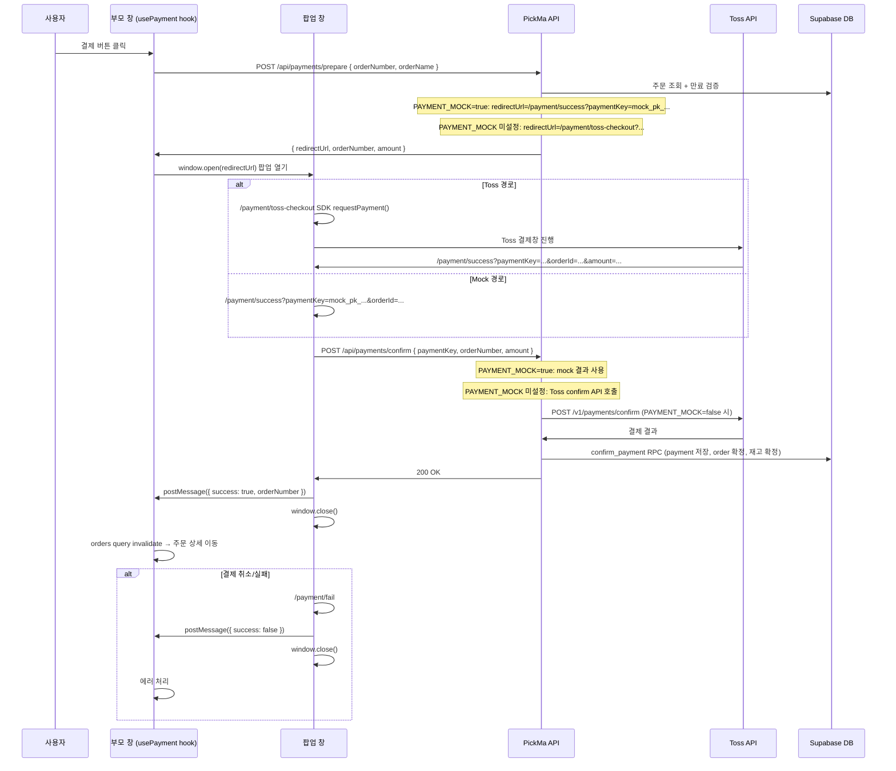

# 시스템 아키텍처

## 1. 기술 스택

| 계층            | 기술                                        | 비고                                                         |
| --------------- | ------------------------------------------- | ------------------------------------------------------------ |
| Frontend        | Next.js 16 App Router, React 19, TypeScript | SSR/CSR 혼합                                                 |
| Styling         | Tailwind CSS, Headless UI                   | UI 구현                                                      |
| Client State    | Zustand                                     | UI/클라이언트 상태                                           |
| Server State    | TanStack Query                              | API 데이터 캐싱, refetch, mutation                           |
| Auth/DB/Storage | Supabase, `@supabase/ssr`                   | Auth, PostgreSQL, Storage                                    |
| Payment         | Toss Payments 직접 연결                     | prepare/confirm 분리, PAYMENT_MOCK 환경변수로 mock/real 분기 |
| Deployment      | Vercel                                      | Next.js 배포                                                 |

---

## 2. 핵심 원칙

- Supabase DB 접근은 클라이언트에서 직접 하지 않고 `src/api` → `src/app/api` Route Handler를 경유한다.
- Supabase Auth는 SDK를 사용하되, 컴포넌트에서 직접 호출하지 않고 `src/api/auth/authApi.ts` 같은 래퍼로 모은다.
- 인증 세션은 `@supabase/ssr` 기반 cookie session 방식을 사용한다.
- Next.js `proxy.ts`는 세션 refresh와 보호 라우트 1차 접근 제어를 담당한다.
- API별 최종 인증, 권한, 리소스 소유권 검증은 Route Handler와 서버 service에서 수행한다.
- Mock/Real 전환은 Route Handler 내부에서 `API_MOCK_ENABLED`로 분기한다.
- 원격 Supabase에 초기 migration이 적용된 이후의 스키마 변경은 incremental migration 파일로 작성한다. 상세 운영 원칙은 `docs/migration_policy.md`를 참고한다.

---

## 3. 전체 데이터 흐름

```text
[ Client ]

Page / Component
  ↓ hook
src/hooks/*
  ↓ domain api
src/api/{domain}/{domain}Api.ts
  ↓ apiClient
src/api/apiClient.ts
  ↓ fetch('/api/...')

[ Server ]

src/app/api/{resource}/route.ts
  ↓ validation/auth/response helpers
src/app/api/_lib/*
  ↓ mock 분기 또는 service 호출
src/mocks/* 또는 src/app/api/{resource}/_lib/service.ts
  ↓ Supabase query
src/lib/supabase/server.ts
  ↓ mapper
src/app/api/{resource}/_lib/mapper.ts
  ↓ contract DTO response
```

---

## 4. 인증과 세션

### 4.1 Supabase Auth 로그인

```text
Client authApi
  -> Supabase Auth SDK
  -> Google/Kakao OAuth 또는 email/password
  -> Supabase callback/session
  -> cookie 기반 세션 저장
```

OAuth 로그인 시작, email/password 로그인, 비밀번호 재설정, 로그아웃은 서버 Route Handler가 아니라 Supabase Auth SDK 래퍼에서 처리한다. 컴포넌트는 Supabase SDK를 직접 호출하지 않고 `src/api/auth/authApi.ts`만 사용한다.

email/password **회원가입**은 가입 전 이메일 선인증(pre-verification) 흐름으로 처리하며, Supabase Auth SDK `signUp()`을 직접 사용하지 않는다. 상세 흐름은 4.4절을 참고한다.

OAuth 로그인 후 PickMa 서비스 내부 `users` row 보장과 role/status 검증은 `/api/users/me`와 서버 인증 helper에서 처리한다.

### 4.2 Proxy 역할

`proxy.ts`는 fetch 요청에 `Authorization` 헤더를 자동 주입하지 않는다. 요청 진입 시점에서 쿠키 기반 세션을 확인/갱신하고, 보호 라우트 접근을 1차로 제어한다.

```text
Browser request
  ↓
src/proxy.ts
  - Supabase 세션 refresh
  - 보호 페이지 redirect
  ↓
Page / Route Handler
```

`config.matcher` 권장안은 정적 asset을 제외한 앱 요청 전반에 적용하는 방식이다. 세션 refresh는 넓게 수행하고, 실제 redirect 대상은 proxy 내부 보호 라우트 목록으로 판단한다. 최종 matcher와 보호 라우트 목록은 Phase 1 구현 전에 한 번 더 확정한다.

```ts
export const config = {
  matcher: [
    '/((?!_next/static|_next/image|favicon.ico|robots.txt|sitemap.xml|.*\\.(?:svg|png|jpg|jpeg|gif|webp|ico)$).*)',
  ],
};
```

로그인은 별도 페이지를 두지 않고, 전역 로그인 모달에서 Supabase OAuth 또는 email/password 로그인을 시작한다. 따라서 proxy는 미인증 페이지 접근 시 `/login`으로 보내지 않고 공개 진입점에 `auth=required`와 `next` query를 붙여 redirect한다. 클라이언트는 해당 query를 보고 로그인 모달을 연다.

전역 AuthModal은 `src/app/layout.tsx`에 mount하고, 모달 open/뷰 전환/next 경로는 `src/components/auth/useAuthModal.ts`의 Zustand UI state로 관리한다. Headless UI `Dialog`를 사용하므로 별도 AuthModalProvider는 두지 않는다.

비밀번호 재설정 요청은 Supabase Auth reset flow를 사용한다. reset link 진입점은 `/auth/reset-password`이며, 해당 페이지는 새 비밀번호 저장 시 `authApi.updatePassword()`를 호출한다.

**비밀번호 정책 (T60):** 최소 10자, 복잡도 요구 없음 (NIST SP 800-63B Rev.4 방향). Supabase Dashboard `Authentication → Password → Minimum password length: 10`과 클라이언트/서버 입력 Zod 스키마를 동일 기준으로 유지한다.

보호 라우트 권장안:

- 공개: `/`, `/search`, `/products/:path*`, `/seller`
- 로그인 필요: `/order/:path*`, `/payment`, `/mypage/:path*`
- 판매자 onboarding 흐름: `/seller/register`, `/seller/pending`은 로그인 사용자를 대상으로 하며, seller application 상태, `users.role`, 내 가게 존재 여부에 따라 seller 영역에서 분기한다.
- 승인된 판매자 필요: `/seller/store/:path*`
- 승인된 판매자와 승인된 가게 필요: `/seller/dashboard/:path*`, `/seller/products/:path*`, `/seller/orders/:path*`, `/seller/menu/:path*`
- 관리자 필요: `/admin/:path*`

미인증 redirect 권장안:

- 소비자 보호 라우트: `/?auth=required&next={pathname}`
- 판매자 보호 라우트: `/seller?auth=required&next={pathname}`
- 관리자 보호 라우트: `/?auth=required&next={pathname}`

#### 접근 제어 3계층 책임 분리

proxy, layout, Route Handler는 서로 다른 책임을 가진다. 3개 계층이 함께 동작해야 안전한 접근 제어가 완성된다.

| 계층                | 파일                                    | 책임                                                        | 신뢰 수준        |
| ------------------- | --------------------------------------- | ----------------------------------------------------------- | ---------------- |
| **Proxy**           | `src/proxy.ts`                          | 세션 refresh + 로그인 여부 1차 redirect (DB role 조회 없음) | 보조             |
| **Layout (client)** | `seller/layout.tsx`, `admin/layout.tsx` | `useMe()` 기반 role 조기 검증 → UX redirect                 | 보조 (신뢰 불가) |
| **Route Handler**   | `src/app/api/_lib/auth.ts`              | `requireSeller()` / `requireAdmin()` 최종 보안 검증         | **신뢰 기준**    |

**Layout guard 정책** (T14 기준):

- layout guard는 `users.role`만 조기 확인한다. store 존재 여부, `stores.status = 'active'`, `operation_status` 검증은 layout 책임이 아니며 Route Handler의 `requireSellerStore()`와 각 서비스 정책에서 처리한다.
- `/seller/register`, `/seller/pending`은 onboarding 라우트로 seller role 없이 로그인 사용자가 접근할 수 있으므로 layout guard에서 제외한다.
- `/seller/dashboard`, `/seller/products`, `/seller/orders`, `/seller/store`, `/seller/menu`는 seller role 필요 (`SELLER_MANAGEMENT_PREFIXES`).
- 오류 redirect 대상:
  - seller 관리 라우트: 미인증(401) → `/seller?auth=required&next=…`, 비seller(403/role 불일치) → `/seller`
  - admin 라우트: 미인증(401) → `/?auth=required&next=…`, 비admin(403/role 불일치) → `/`
- network/5xx 오류는 redirect 대상이 아니며, 오류 안내와 재시도 UI를 제공한다.

### 4.4 이메일 선인증 흐름 (email/password 회원가입)

email/password 회원가입은 가입 전 이메일 선인증(pre-verification) 방식으로 처리한다. Supabase 기본 `signUp()` confirmation OTP는 UX 목표와 맞지 않으므로 사용하지 않는다.

```text
Client
  1. AuthModal 이메일 입력 → "이메일 인증하기" 클릭
  2. POST /api/auth/email-verifications/request
       -> emailHash/ipHash HMAC 생성
       -> checkAndIncrementRequestLimit (email/IP rate limit)
       -> public.users.email 중복 확인 (이미 존재하면 AUTH_EMAIL_ALREADY_EXISTS)
       -> 6자리 OTP 생성 (hash 저장)
       -> issueChallenge (Upstash Redis에 challenge 저장, 이전 active challenge 무효화)
       -> Resend HTTP API fetch로 OTP 메일 발송
       -> challenge status = 'sent' (발송 성공) / 'send_failed' (발송 실패)
  3. Client: OTP input 노출, 재전송 버튼 노출
  4. POST /api/auth/email-verifications/verify
       -> emailHash로 active challenge 조회 (status = 'sent', 미만료)
       -> OTP hash 비교, attempt count 증가 (5회 초과 시 AUTH_EMAIL_OTP_ATTEMPT_LIMIT_EXCEEDED)
       -> 성공 시 verification token 생성 (hash 저장, challenge status = 'verified')
       -> raw verification token 1회 반환
  5. Client: OTP input 숨김, "인증 완료" 표시, verification token React local state에 저장
  6. POST /api/auth/email-signup (verification token + email + password + name + marketingAgreed)
       -> verification token hash + emailHash + expiry + status 검증
       -> verified → signup_in_progress 원자적 전환 (동시 제출 방지)
       -> auth.admin.createUser({ email, password, email_confirm: true, user_metadata: { name } })
       -> public.users row 생성 (id, email, name, marketing_agreed, marketing_agreed_at, role/status 기본값)
       -> 실패 시 Auth user 보상 삭제 + token 처리 (상세는 아래)
       -> 성공 시 token status = 'consumed'
  7. Client: completeEmailSignup 성공 후 signInWithPassword로 세션 생성 → next 이동
```

보상 처리 정책:

- `public.users` row 생성 실패 + Auth user 보상 삭제 성공: token을 `verified`로 되돌려 재시도 가능하게 처리
- `public.users` row 생성 실패 + 보상 삭제 실패: token을 `consumed`로 닫고 운영 확인 항목으로 기록. 서버 로그에는 auth user id, email hash, error만 남기고 raw email 미포함
- `auth.admin.createUser()` conflict (race condition): token을 `consumed`로 닫고 `AUTH_EMAIL_ALREADY_EXISTS` 반환

OTP/token 저장소 정책 (Upstash Redis):

| 키 패턴                                     | 내용                                        | TTL                                     |
| ------------------------------------------- | ------------------------------------------- | --------------------------------------- |
| `auth:email:signup:{emailHash}:current`     | current challenge id                        | OTP TTL                                 |
| `auth:email:signup:challenge:{challengeId}` | OTP hash, email hash, status                | OTP TTL → 검증 성공 시 token TTL로 연장 |
| `auth:email:signup:verify:{tokenHash}`      | email hash, challenge id, expiresAt, status | verification token TTL                  |
| `auth:email:signup:rate:email:{emailHash}`  | 발송 요청 count                             | request window                          |
| `auth:email:signup:rate:ip:{ipHash}`        | 발송 요청 count                             | request window                          |
| `auth:email:signup:attempt:{challengeId}`   | 검증 attempt count                          | OTP TTL                                 |

기본값: OTP window 10분, email 발송 요청 제한 3회, IP 발송 요청 제한 10회, OTP 검증 attempt 5회, signup_in_progress lock 30초

보안 정책:

- Redis key/value에 raw email, raw IP, OTP 원문, token 원문 저장 금지
- email/IP hash는 `AUTH_EMAIL_HASH_SECRET` 기반 HMAC으로 생성
- `AUTH_EMAIL_HASH_SECRET`은 32바이트 이상 랜덤 값, `scripts/generate-auth-email-hash-secret.mjs`로 생성
- OTP 재전송 시 이전 active challenge는 즉시 무효화 (메일 발송 전에 새 challenge를 active로 전환)

메일 발송 정책:

- 가입 전 OTP 메일: PickMa 서버 Route Handler → Resend HTTP API `fetch` 직접 호출 (Resend SDK/package 미사용)
- password reset 등 Supabase Auth 메일: Supabase custom SMTP (Resend SMTP 연결)

### 4.5 OAuth + email/password 중복 이메일 처리

- OTP 요청 단계의 중복 이메일 확인 기준: `public.users.email`
- OAuth 계정과 동일 이메일도 `public.users.email` 기준으로 email/password 신규 가입을 차단하고 로그인/비밀번호 재설정 안내
- email signup Route Handler가 `public.users` row를 직접 생성한다. 이후 `/api/users/me`의 `getOrCreateUserByAuthUser()`는 이미 생성된 row를 반환하는 기존 흐름 유지
- `auth.admin.createUser()` conflict는 race condition 또는 예외 상태의 마지막 방어선으로 `AUTH_EMAIL_ALREADY_EXISTS`로 매핑

### 4.3 Supabase client 분리

```text
src/lib/supabase/client.ts   # 브라우저용 Supabase client
src/lib/supabase/server.ts   # Route Handler / Server Component용 Supabase client
src/lib/supabase/proxy.ts    # proxy 세션 refresh용 helper
src/lib/supabase/service.ts  # service_role 서버 전용 client (RLS bypass, 서버 전용)
```

- Supabase browser/server/proxy client는 `@supabase/ssr` 기준으로 구현한다.
- Phase 1에서 패키지를 추가하고, 실제 `proxy.ts`와 server client가 cookie session을 갱신/읽는지 동작 확인한다.

---

## 5. API 레이어 구조

### 5.1 클라이언트 API

```text
src/api/
  apiClient.ts
  auth/
    authApi.ts
  products/
    productApi.ts
    productMapper.ts
  orders/
    orderApi.ts
    orderMapper.ts
  stores/
    storeApi.ts
    storeMapper.ts
  seller-applications/
    sellerApplicationApi.ts
    sellerApplicationMapper.ts
  files/
    fileApi.ts
  users/
    userApi.ts
    userMapper.ts
  seller/
    onboarding/
      sellerOnboardingApi.ts
      sellerOnboardingMapper.ts
    products/
      sellerProductApi.ts
      sellerProductMapper.ts
    orders/
      sellerOrderApi.ts
      sellerOrderMapper.ts
  admin/
    sellers/
      adminSellerApplicationApi.ts
      adminSellerApplicationMapper.ts
    stores/
      adminStoreApi.ts
      adminStoreMapper.ts
    users/
      adminUserApi.ts
      adminUserMapper.ts
    products/
      adminProductApi.ts
      adminProductMapper.ts
    orders/
      adminOrderApi.ts
      adminOrderMapper.ts
```

- `apiClient`는 fetch 래퍼, query string 조립, JSON 파싱, envelope 해석, 공통 에러 변환을 담당한다.
- cookie 기반 세션을 사용하므로 `Authorization: Bearer`를 직접 주입하지 않는다.
- `credentials: 'include'`를 기본 적용한다.
- 성공 시 `envelope.data`만 반환하고, 실패 시 `ApiError`를 throw한다.
- 도메인 API 객체는 단수형으로 둔다. 예: `productApi`, `orderApi`.
- 공개/소비자 API, 판매자 API, 관리자 API는 접근 주체와 반환 데이터가 다르므로 클라이언트 API와 hook도 역할별로 분리한다.
- 파일 업로드는 도메인별 API가 아니라 `files/fileApi.ts` 공통 helper가 signed upload URL 발급과 실제 업로드를 감싼다. 도메인 hook은 파일 helper를 조합해 최종 도메인 API를 호출한다.
- `src/api`와 `src/hooks`는 Phase 1에서 도메인별 barrel export를 만들지 않고 직접 파일 import를 기본으로 한다.
- barrel export는 `src/types/index.ts`, `src/contracts/index.ts`, `src/lib/errors/index.ts`처럼 공통 타입/contract/error에 한정해 사용한다.

### 5.2 서버 Route Handler

```text
src/app/api/
  _lib/
    auth.ts
    response.ts
    validation.ts
  products/
    route.ts
    [productId]/
      route.ts
    _lib/
      service.ts
      mapper.ts
      schemas.ts
```

- `route.ts`는 HTTP method, query/body parsing, 인증 helper 호출, 응답 envelope 생성을 담당한다.
- 도메인 내부 보조 파일은 `src/app/api/{resource}/_lib/`에 둔다.
- `service.ts`는 HTTP 객체를 알지 않고 Supabase query와 비즈니스 로직을 담당한다.
- `mapper.ts`는 Supabase row/join 결과를 contract DTO로 변환한다.
- `schemas.ts`는 해당 도메인 Route Handler의 Zod schema를 담당한다.
- 파일명 앞에 `_`를 붙이지 않고, Next.js private folder인 `_lib/`만 사용한다.

#### resource `_lib` 경계 원칙

- **금지**: resource-local `_lib` → 다른 resource-local `_lib` 직접 import
- **금지**: 전역 `src/app/api/_lib/` → resource-local `_lib` 직접 import
- **허용**: resource-local `_lib` → `src/app/api/_lib/*`
- 둘 이상의 resource route/service가 같은 row → contract mapper를 공유해야 하면 `src/app/api/_lib/*-mapper.ts`에 둔다. 예: `order-mapper.ts`, `payment-mapper.ts`, `user-mapper.ts`.
- 공통 route helper(auth, response, validation, cross-resource 공유 로직)는 `src/app/api/_lib/`에 둔다.

### 5.3 서버 인증/권한 helper

- `requireActiveUser()`: 로그인된 active 사용자 확인.
- `requireAdmin()`: `users.role = 'admin'` 확인.
- `requireSeller()`: `users.role = 'seller'` 확인. 승인된 판매자이지만 아직 가게가 없는 상태를 허용한다.
- `requireSellerStore()`: `requireSeller()` 이후 내 가게 존재와 `stores.status = 'active'`를 확인한다. `operation_status`는 확인하지 않으며, 소비자 공개 조회와 주문 생성 차단은 각 service/RPC에서 별도로 처리한다.

상품/주문처럼 가게 소유권이 필요한 seller API는 `requireSellerStore()`를 사용한다. 가게 등록, seller onboarding 상태 조회처럼 가게가 아직 없을 수 있는 흐름은 `requireSeller()` 또는 `requireActiveUser()`를 사용한다.

판매자 승인은 `seller_applications.status = 'approved'`와 `users.role = 'seller'` 전환을 atomic하게 처리한다. `seller_applications`에는 `reviewed_by`를 저장하지 않고, 관리자 작업자 추적은 후속 감사 로그 도메인에서 다룬다.

---

## 6. 상태 관리

| 대상               | 도구           | 예시                             |
| ------------------ | -------------- | -------------------------------- |
| 서버 상태          | TanStack Query | 상품 목록, 주문 목록, 가게 정보  |
| 클라이언트/UI 상태 | Zustand        | 모달, 임시 선택값, UI preference |

Query key는 route/API 폴더와 맞춰 복수형 도메인명을 사용한다.

```text
['products', 'list', params]
['products', 'detail', productId]
['orders', 'list', params]
['orders', 'detail', orderId]
['stores', 'my']
['users', 'me']
['admin', 'stores', 'list', params]
```

Hook은 하나의 파일에 하나씩 둔다.

```text
src/hooks/products/useProducts.ts
src/hooks/products/useProduct.ts
src/hooks/products/useCreateProduct.ts
src/hooks/seller/products/useSellerProducts.ts
src/hooks/admin/products/useAdminProducts.ts
```

TanStack Query Provider는 `src/app/providers.tsx`에 둔다. `providers.tsx`는 `'use client'` 컴포넌트이며 `src/app/layout.tsx`에서 `<Providers>{children}</Providers>`로 감싼다.

---

## 7. 결제 흐름



- `POST /api/orders`: 주문 생성과 재고 임시 예약. `orderNumber`(PickMa 내부 식별자)를 반환한다.
- `usePayment` hook: `openPayment({ orderNumber, orderName })` 한 번 호출로 prepare → 팝업 열기 → postMessage 수신까지 처리한다.
- `POST /api/payments/prepare`: `PAYMENT_MOCK=true`이면 `/payment/success?paymentKey=mock_pk_...&orderId={orderNumber}&amount={amount}`를 반환한다. 그 외에는 `/payment/toss-checkout?orderNumber=...&amount=...&orderName=...`를 반환한다.
- `/payment/toss-checkout`: Toss SDK `requestPayment()`를 호출한다. 성공 시 `/payment/success`, 실패/취소 시 `/payment/fail`로 리다이렉트된다.
- `/payment/success`: URL 파라미터(`paymentKey`, `orderId`, `amount`)를 받아 `POST /api/payments/confirm`을 호출한다. 성공/실패 모두 `postMessage` 후 팝업을 닫는다.
- `/payment/fail`: `postMessage({ success: false })` 후 팝업을 닫는다.
- `postMessage` `targetOrigin`은 항상 `window.location.origin`을 명시하며 와일드카드(`'*'`)는 사용하지 않는다.
- 부모 창: `message` 이벤트를 수신할 때 `event.origin === window.location.origin` 검증 및 `event.source === popup` 검증을 모두 수행한다.
- `POST /api/payments/confirm`: Toss confirm API(`POST https://api.tosspayments.com/v1/payments/confirm`)를 서버에서 호출 후 `confirm_payment` DB RPC로 주문을 atomic하게 확정한다.
- 향후 provider adapter로 확장할 경우 결제 승인 주체는 `toss | kakao_pay | naver_pay` 중 하나로 표현하고, provider별 외부 주문 필드명은 adapter 내부에서만 다룬다.
- `POST /api/payments/webhook`: 결제 상태 동기화용 endpoint. Toss adapter 구현 시 운영 필수성을 재판정하며, 기본 우선순위는 P1(backlog)이다.
- 주문 생성, 결제 확정, 예약 해제에 따른 재고 변경은 Postgres RPC/transaction으로 atomic하게 처리한다.
- `payment_pending` 주문은 `expiresAt` 이후 `expired`로 전환하고 `reserved_stock`을 복구한다.
- 초기 구현은 API 진입 시 lazy cleanup과 결제 confirm 시점 검사를 사용하고, scheduled job/cron은 MVP 이후 보강한다.
- **Toss confirm 성공 + `confirm_payment` RPC 실패 시 보상 정책(Option B)**: Toss confirm 직후 내부 `confirm_payment` RPC가 실패하면 실제 결제는 승인됐지만 주문은 `processing` 상태에 잔류하는 gap이 발생한다. 보상 정책으로 Option B를 채택한다.
  - `PAYMENT_MOCK=false`: `callTossCancel`로 Toss 자동 취소 시도 → 성공 시 `revert_payment_processing` RPC로 주문을 `payment_pending`으로 복구(best-effort)
  - `PAYMENT_MOCK=true`: Toss cancel 미호출, `revert_payment_processing`만 시도
  - fallback 상태:
    - cancel 성공 + revert 성공 → 결제 취소, 주문 `payment_pending` 복구
    - cancel 실패 → 결제 승인 상태 유지, 주문 `processing` 잔류 (운영 알람 대상)
    - cancel 성공 + revert 실패 → 결제 취소, 주문 `processing` 잔류 (운영 알람 대상)
  - `processing` 상태로 30분 이상 잔류하는 주문은 운영 알람 대상이며 수동 확인이 필요하다.
  - 결제 이벤트 모델(outbox/webhook/idempotency) 설계: `docs/payment_event_design.md`. 구현은 T62(`payment_events` 테이블 migration + `payment_confirmed` 이벤트 INSERT), T63(webhook Route Handler)에서 진행한다.
  - A-ORDER-01 `status=processing` filter 스펙: `docs/api_spec.md` 10.4절 (P1)

### 7.1 정산대행 설계 원칙

PickMa는 기본적으로 Toss 정산대행을 사용하지만, 다른 정산대행사 또는 자체 정산으로 전환이 가능하도록 설계한다.

- 정산대행사 의존 코드는 adapter 계층으로 격리하고, 상위 도메인 로직이 provider에 직접 종속되지 않게 한다.
- KYC(셀러 신원 확인)는 정산대행 서비스가 담당하는 구조를 전제로 하며, 이 전제가 유지되는 한 PickMa는 신분증 원본을 수집하지 않는다. PickMa가 KYC를 직접 수행하는 구조로 전환되는 경우에는 T44 결정을 재검토하고 PIPA 제23·24조 별도 동의 필요 여부를 다시 확인한다.
- provider 교체 시 변경 범위: adapter 구현체, 환경변수, 외부 API 호출부에 한정한다. 주문/결제 도메인 로직과 DB 스키마는 영향받지 않는 것을 목표로 한다.

---

## 8. Mock 전략

```env
API_MOCK_ENABLED=true
```

- `NEXT_PUBLIC_`을 붙이지 않는다. Route Handler 서버 영역에서만 읽는다.
- Mock 데이터는 `src/mocks`에 도메인별로 둔다.
- Mock 데이터는 contract DTO 기준으로 작성한다.
- 클라이언트 API, hook, component는 mock/real 여부를 알지 않는다.
- 페이지 작업 중 필요한 임시 데이터도 hook/component 내부에 두지 않고 `src/mocks`에 추가한다.
- hook 반환 타입은 mock/real 전환과 무관하게 Domain 기준을 유지한다.
- `API_MOCK_ENABLED=true`에서는 query와 mutation 모두 mock 응답을 반환해 페이지 플로우를 확인할 수 있게 한다.
- `API_MOCK_ENABLED=false`에서 아직 구현되지 않은 API는 `NOT_IMPLEMENTED` 에러를 반환한다.

```text
src/mocks/
  products.ts
  orders.ts
  stores.ts
  users.ts
  payments.ts
  seller.ts
  admin.ts
```

- Phase 1에서는 도메인별 단일 mock 파일로 시작한다.
- mock 케이스가 많아지면 후속 PR에서 `src/mocks/{domain}/` 폴더로 분리한다.

### import 정책

- `src/mocks`는 Route Handler mock fixture 전용 위치다.
- `src/components`, `src/hooks`, `src/stores`, `src/api` (클라이언트), `src/app` 페이지/레이아웃에서 `src/mocks`를 직접 import하지 않는다.
- 앱 화면의 mock 데이터 소비는 Route Handler mock 응답(`isApiMockEnabled()`), story fixture, test fixture 경계를 통해서만 이루어진다.
- 직접 import 허용 범위: `src/app/api/**` Route Handler, `*.test.ts`, `*.test.tsx`, `*.stories.ts`, `*.stories.tsx`
- 위반은 ESLint `no-restricted-imports` + `import/no-restricted-paths` rule로 자동 감지한다.

---

## 9. 폴더 구조

```text
src/
  app/
    (consumer)/
    (seller)/seller/
    (admin)/admin/
    auth/
      reset-password/
    payment/
      success/
    api/
      _lib/
      products/
        _lib/
        [productId]/
      orders/
        _lib/
      payments/
        _lib/
      users/
      stores/
      seller/
      admin/
    layout.tsx
    globals.css

  api/
    apiClient.ts
    auth/
    products/
    orders/
    stores/
    users/
    seller-applications/
    files/
    seller/
      products/
      orders/
    admin/
      sellers/
      stores/
      users/
      products/
      orders/

  contracts/
    common.ts
    auth.ts
    product.ts
    order.ts
    payment.ts
    store.ts
    user.ts
    admin.ts

  types/
    auth.ts
    product.ts
    order.ts
    payment.ts
    store.ts
    user.ts

  hooks/
    products/
    orders/
    stores/
    users/
    seller/
      products/
      orders/
    admin/
      stores/
      users/
      products/
      orders/
  stores/
  components/
  lib/
    errors/
    supabase/
      client.ts
      server.ts
      proxy.ts
      service.ts     # service_role 서버 전용 client
      database.ts    # CLI generated, 직접 수정 금지
  mocks/
```

---

## 10. 환경 변수

| 변수명                                      | 용도                                                          | 공개 여부 |
| ------------------------------------------- | ------------------------------------------------------------- | --------- |
| `NEXT_PUBLIC_SUPABASE_URL`                  | Supabase URL                                                  | Public    |
| `NEXT_PUBLIC_SUPABASE_PUBLISHABLE_KEY`      | Supabase Publishable key                                      | Public    |
| `SUPABASE_SECRET_KEY`                       | 관리자/서버 전용 Supabase key                                 | Secret    |
| `NEXT_PUBLIC_TOSS_CLIENT_KEY`               | Toss 클라이언트 키                                            | Public    |
| `TOSS_SECRET_KEY`                           | Toss Secret key                                               | Secret    |
| `NEXT_PUBLIC_APP_URL`                       | 앱 URL                                                        | Public    |
| `API_MOCK_ENABLED`                          | Route Handler mock 응답 여부                                  | Secret    |
| `PAYMENT_MOCK`                              | `true`이면 Toss API 미호출, mock 결제 결과 반환. 로컬 개발용. | Secret    |
| `UPSTASH_REDIS_REST_URL`                    | Upstash Redis REST URL (이메일 인증 OTP 상태 저장소)          | Secret    |
| `UPSTASH_REDIS_REST_TOKEN`                  | Upstash Redis REST Token                                      | Secret    |
| `AUTH_EMAIL_HASH_SECRET`                    | 이메일/IP HMAC hash 생성용 서버 시크릿 (32바이트 이상 랜덤값) | Secret    |
| `RESEND_API_KEY`                            | Resend API Key (OTP 메일 발송)                                | Secret    |
| `AUTH_EMAIL_FROM`                           | OTP 메일 발신 주소 (Resend 인증 도메인)                       | Secret    |
| `AUTH_EMAIL_OTP_TTL_SECONDS`                | OTP 유효 시간 (기본값 600초)                                  | Secret    |
| `AUTH_EMAIL_VERIFICATION_TOKEN_TTL_SECONDS` | verification token 유효 시간 (기본값 1800초)                  | Secret    |
| `CRON_SECRET`                               | Vercel Cron 인증용 서버 시크릿 (32바이트 이상 랜덤값)         | Secret    |
| `IP_SOURCE_HEADER`                          | rate limit 기준 헤더 (`x-forwarded-for`)                      | Secret    |

---

## 11. CI/CD

GitHub Actions 기본 CI는 PR과 `dev`/`main` push에서 실행한다.

초기 CI job은 다음 명령을 순서대로 실행한다.

```bash
npm ci
npx playwright install --with-deps chromium
npm run lint
npm run typecheck
npm run test
```

`npm run test`에는 Storybook/Vitest browser project가 포함되므로 Chromium browser를 설치한다. E2E job은 T23 완료 후 별도 workflow 또는 job으로 분리하며, 이 기본 CI job에는 포함하지 않는다.

CI 환경 변수는 실제 외부 서비스에 연결하지 않는 mock/test 값을 사용한다.

| 변수명                                      | CI 기본값                                | 비고                                       |
| ------------------------------------------- | ---------------------------------------- | ------------------------------------------ |
| `API_MOCK_ENABLED`                          | `true`                                   | Route Handler mock mode                    |
| `PAYMENT_MOCK`                              | `true`                                   | Toss API 미호출                            |
| `NEXT_PUBLIC_APP_URL`                       | `http://localhost:3000`                  | 앱 URL                                     |
| `NEXT_PUBLIC_SUPABASE_URL`                  | `http://127.0.0.1:54321`                 | test placeholder                           |
| `NEXT_PUBLIC_SUPABASE_PUBLISHABLE_KEY`      | `test-publishable-key`                   | test placeholder                           |
| `SUPABASE_SECRET_KEY`                       | `test-secret-key`                        | test placeholder, secret 아님              |
| `NEXT_PUBLIC_TOSS_CLIENT_KEY`               | `test_ck_ci`                             | test placeholder                           |
| `TOSS_SECRET_KEY`                           | `test_sk_ci`                             | test placeholder, secret 아님              |
| `UPSTASH_REDIS_REST_URL`                    | `http://localhost:6379`                  | test placeholder (단위 테스트는 mock 사용) |
| `UPSTASH_REDIS_REST_TOKEN`                  | `test-redis-token`                       | test placeholder                           |
| `AUTH_EMAIL_HASH_SECRET`                    | `test-hash-secret-32byte-placeholder000` | test placeholder (32바이트 이상)           |
| `RESEND_API_KEY`                            | `re_test_ci`                             | test placeholder                           |
| `AUTH_EMAIL_FROM`                           | `noreply@test.example`                   | test placeholder                           |
| `AUTH_EMAIL_OTP_TTL_SECONDS`                | `600`                                    | 기본값                                     |
| `AUTH_EMAIL_VERIFICATION_TOKEN_TTL_SECONDS` | `1800`                                   | 기본값                                     |

`npm run build`는 초기 CI 필수 job에 포함하지 않고, 팀 결정 후 별도 job으로 추가한다.

Branch protection은 `dev` 대상 PR에서 `CI / Lint, typecheck, and test` 통과를 필수 check로 설정한다. 저장소 설정은 GitHub UI에서 관리한다.

---

## 12. 보안 고려사항

| 항목        | 대응 방안                                                                        |
| ----------- | -------------------------------------------------------------------------------- |
| 인증        | Supabase Auth, cookie session, proxy refresh                                     |
| 페이지 접근 | proxy에서 보호 라우트 1차 제어                                                   |
| API 권한    | Route Handler/helper/service에서 최종 검증                                       |
| 데이터 접근 | 클라이언트 DB 직접 접근 금지, RLS 병행                                           |
| 결제        | `TOSS_SECRET_KEY`는 서버에서만 사용, confirm API 서버 호출, client bundle 미노출 |
| 환경 변수   | 민감 정보는 서버 전용 변수로 관리                                                |

---

## 13. 확장 포인트

| 기능        | 확장 방안                          |
| ----------- | ---------------------------------- |
| 지도        | Kakao Maps API 연동                |
| 실시간 알림 | Supabase Realtime 구독 (18절 참고) |
| AI 추천     | OpenAI API 연동                    |
| Webhook     | Toss 결제 상태 동기화              |
| CI/CD       | GitHub Actions 워크플로우          |

---

## 14. Storage lifecycle 정책

### 14.1 Bucket 목록

| Bucket                         | 접근    | 민감도 | cleanup 우선순위 |
| ------------------------------ | ------- | ------ | ---------------- |
| `seller-application-documents` | private | 높음   | P1/P2            |
| `store-images`                 | public  | 낮음   | P3               |
| `product-images`               | public  | 낮음   | P3               |
| `profile-images`               | public  | 낮음   | P3               |

파일 저장 경로 패턴:

- seller-application-documents: `{userId}/{uploadId}/{documentType}/{fileName}`
- store-images: `{userId}/{uploadId}/{fileName}`
- product-images: `{storeId}/{uploadId}/{fileName}`
- profile-images: `{userId}/{uploadId}/{fileName}`

`seller-application-documents`에 저장 가능한 문서 타입은 사업자등록증(`business_license`), 영업신고증(`food_service_permit`), 통장사본(`bank_account`) 3종으로 한정한다. 신분증(`id_card`)은 T44 결정으로 수집 대상에서 제외된다 (T61에서 코드/DB 기준 제거).

### 14.2 Orphan cleanup 방식

클라이언트 best-effort와 서버 주기적 orphan 스캔의 hybrid 방식을 채택한다.

**클라이언트 (hook, P1)**

- 도메인 API 실패 시 업로드 성공 파일의 `storagePath` 목록으로 `DELETE /api/files` 호출.
- cleanup 실패는 로깅만 하고 에러를 전파하지 않는다 (best-effort).

**서버 (Vercel Cron, P2)**

- bucket 파일 목록과 DB `seller_application_documents.storage_path`를 비교한다.
- DB에 없고 생성 후 30일을 초과한 orphan 파일을 주기적으로 삭제한다 (클라이언트 best-effort cleanup 실패분의 safety net).
- endpoint: `GET /api/cron/storage-cleanup`
- 인증: `Authorization: Bearer ${CRON_SECRET}` (서버 전용 환경 변수, client bundle 미노출). 인증 실패 시 401 반환.

### 14.3 보관 기간 정책

개인정보보호법의 "처리목적 달성 후 지체 없이 파기" 원칙을 기준으로 한다. 세부 기간은 법무/운영 확인 후 최종 확정한다.

| 상태                                      | 보관 기간                                        |
| ----------------------------------------- | ------------------------------------------------ |
| orphan (도메인 API 실패)                  | 생성 후 30일 이내 삭제                           |
| 승인(`approved`), 판매자 활동 중          | 판매자 활동 기간 보관                            |
| 승인 후 회원 탈퇴                         | 30일 이내 원본 서류 삭제                         |
| 판매자 자격 종료 / 가게 비활성화          | 진행 중 주문·정산·분쟁 없으면 30일 이내 삭제     |
| 판매자 자격 종료 (진행 중 주문/분쟁 있음) | 해당 처리 완료 후 30일 이내 삭제                 |
| 거부(`rejected`)                          | 거부 확정 후 30일 이내 삭제                      |
| 철회 / 만료                               | 지체 없이 삭제 대상                              |
| 분쟁 / 법령 대응 필요                     | 원본 파일 장기 보관 금지, 최소 메타데이터만 보존 |

### 14.4 삭제 트리거 및 주체

| 트리거             | 주체               | 구현 시점 |
| ------------------ | ------------------ | --------- |
| 도메인 API 실패    | 클라이언트 (hook)  | P1        |
| 신청 거부          | 서버 Route Handler | P1        |
| 회원 탈퇴          | 서버 Route Handler | P2        |
| 판매자 자격 종료   | 서버 Route Handler | P2        |
| 주기적 orphan 스캔 | Vercel Cron        | P2        |

삭제 실행:

- 클라이언트 cleanup: 본인 인증(`requireActiveUser()`) 후 `DELETE /api/files`. userId prefix로 소유권 검증 후 `seller_application_documents`에 참조 중인 경로는 삭제하지 않는다 (FORBIDDEN 403).
- 서버 cleanup: service role client (RLS bypass).

### 14.5 향후 재검토 사항

- **[T44 결정 완료]** PickMa는 별도 정산대행 서비스(현재 Toss)를 사용하는 구조이며, 해당 서비스가 셀러 신원 확인(KYC)을 담당한다. 따라서 PickMa가 신분증 원본을 직접 보관할 의무가 없다. 판매자 신청 서류를 사업자등록증·영업신고증·통장사본 3종으로 한정하고 신분증(`id_card`)을 제외한다. 코드/DB 기준 제거는 T61에서 진행한다.
- 분쟁 대응에 필요한 최소 메타데이터 범위 확인 (운영/CS 정책).
- public bucket(store-images, product-images, profile-images) orphan 처리는 P3에서 결정.

---

## 15. service role 사용 기준

`createServiceRoleClient()`는 RLS를 우회하므로 남용하면 사용자·판매자·관리자 데이터 노출 위험이 생긴다. 반드시 아래 허용 케이스에 해당할 때만 사용한다.

### 15.1 허용 케이스

| 케이스                | 설명                                                          | 예시                                                           |
| --------------------- | ------------------------------------------------------------- | -------------------------------------------------------------- |
| RPC 호출              | DB function은 RLS가 아닌 SECURITY DEFINER로 실행              | `create_order`, `confirm_payment`, `create_seller_application` |
| 초기 row 생성         | 사용자 최초 로그인 시 users row INSERT — RLS INSERT 정책 없음 | `getOrCreateUserByAuthUser`                                    |
| admin cross-user 조작 | admin이 타 사용자 데이터 조회/변경                            | `getPendingSellerApplications`, `approveSellerApplication`     |
| Storage API           | Supabase Storage에는 RLS가 없어 service role 필수             | `createSignedUploadUrl`, Storage orphan cleanup                |

### 15.2 금지 케이스

단순 owner-scoped SELECT는 service role을 사용하지 않는다. `createServerClient()` + RLS 정책으로 처리한다.

- `orders.user_id = auth.uid()` 기준 소비자 주문 조회
- `products.store_id ∈ 내 가게` 기준 판매자 상품 조회
- `users.id = auth.uid()` 기준 프로필 조회/수정

### 15.3 RLS 전환 후보 목록

현재 service role을 사용하지만 RLS+server client로 전환 가능한 후보다. 전환 전 해당 테이블의 RLS 정책 추가가 전제 조건이며, 실제 전환은 후속 task에서 수행한다.

| 파일                                       | 함수                                                               | scope 유형                                 | 전제 조건          |
| ------------------------------------------ | ------------------------------------------------------------------ | ------------------------------------------ | ------------------ |
| `_lib/auth.ts`                             | `checkApplicationEligibility`                                      | `seller_applications.user_id = auth.uid()` | RLS 정책 확인 필요 |
| `orders/_lib/service.ts`                   | `getOrders`, `getOrder`                                            | `orders.user_id = auth.uid()`              | RLS 정책 추가      |
| `seller/orders/_lib/service.ts`            | `getSellerOrders`, `getSellerOrder`                                | `orders.store_id ∈ 내 가게`                | RLS 정책 추가      |
| `seller/orders/_lib/service.ts`            | `acceptSellerOrder`, `markSellerOrderReady`, `completeSellerOrder` | store 소유권 필터                          | RLS 정책 추가      |
| `seller/products/_lib/service.ts`          | 전체                                                               | `products.store_id ∈ 내 가게`              | RLS 정책 추가      |
| `seller/menu-items/_lib/service.ts`        | 전체                                                               | `menu_items.store_id ∈ 내 가게`            | RLS 정책 추가      |
| `seller/onboarding-status/_lib/service.ts` | `getSellerOnboardingStatus`                                        | 여러 테이블 user 소유                      | RLS 정책 추가      |
| `users/me/_lib/service.ts`                 | profile 조회/수정                                                  | `users.id = auth.uid()`                    | RLS 정책 확인      |

---

## 16. Route Handler 보안 checklist

신규 Route Handler를 구현하거나 기존 Route Handler를 수정할 때 아래 항목을 확인한다.

### 16.1 auth helper 선택 기준

| 조건                           | 사용할 helper                                           |
| ------------------------------ | ------------------------------------------------------- |
| 로그인 사용자 전용 (role 무관) | `requireActiveUser()`                                   |
| 판매자 전용 (가게 불필요)      | `requireSeller()`                                       |
| 판매자 전용 + 가게 필요        | `requireSellerStore()`                                  |
| 관리자 전용                    | `requireAdmin()`                                        |
| 판매자 신청 자격 확인          | `requireActiveUser()` + `checkApplicationEligibility()` |

### 16.2 owner scope 검증 원칙

- auth helper가 반환한 `authUser.id` / `store.id`를 service에 직접 전달해 소유권 필터를 적용한다.
- service 내부에서 params의 id를 무검증으로 사용하지 않는다. Route Handler에서 auth → params → service 순서로 검증한다.
- 민감 리소스(admin 전용, 개인 문서, 결제)는 auth를 params/body 검증보다 먼저 수행하는 것을 권장한다.

### 16.3 응답 민감도 원칙

- 에러 응답에 DB 쿼리 오류 메시지, 내부 파일 경로, 타 사용자 ID 등 민감 정보를 포함하지 않는다.
- `routeError(error)`는 `AppError`만 클라이언트에 노출하고, 그 외는 `INTERNAL_SERVER_ERROR`로 처리한다.

### 16.4 P0/P1 API owner scope 테스트 커버리지

| API                                                          | 우선순위 | 필요 scope               | 현재 테스트 | T07 조치              | 후속 task               |
| ------------------------------------------------------------ | -------- | ------------------------ | ----------- | --------------------- | ----------------------- |
| `GET /api/admin/sellers/pending`                             | P0       | admin                    | 없음        | 추가                  | —                       |
| `POST /api/admin/sellers/[applicationId]/approve`            | P0       | admin                    | 없음        | 추가                  | —                       |
| `POST /api/admin/sellers/[applicationId]/reject`             | P0       | admin                    | 없음        | 추가                  | —                       |
| `POST /api/admin/seller-application-documents/[id]/read-url` | P0       | admin                    | 없음        | 추가                  | —                       |
| `GET /api/admin/stores`                                      | P0       | admin                    | 추가        | 완료                  | —                       |
| `GET /api/admin/dashboard/stats`                             | P1       | admin                    | 추가        | 완료                  | —                       |
| `POST /api/seller-applications`                              | P0       | activeUser + eligibility | 없음        | 추가                  | —                       |
| `GET /api/seller/onboarding-status`                          | P0       | activeUser               | 없음        | 추가                  | —                       |
| `GET /api/users/me`                                          | P0       | activeUser               | 없음        | 추가                  | —                       |
| `POST /api/stores`                                           | P0       | seller                   | 있음        | 기존 확인             | —                       |
| `GET /api/stores/me`                                         | P0       | seller                   | 있음        | 기존 확인             | —                       |
| `GET /api/seller/products`                                   | P0       | seller                   | 있음        | 기존 확인             | —                       |
| `POST /api/seller/products`                                  | P0       | seller                   | 있음        | 기존 확인             | —                       |
| `PATCH /api/seller/products/[productId]`                     | P0       | seller                   | 있음        | 기존 확인             | —                       |
| `DELETE /api/seller/products/[productId]`                    | P0       | seller                   | 있음        | 기존 확인             | —                       |
| `GET /api/seller/orders`                                     | P0       | sellerStore              | 있음        | 기존 확인             | —                       |
| `GET /api/seller/orders/[orderId]`                           | P0       | sellerStore              | 있음        | 기존 확인             | —                       |
| `PATCH /api/seller/orders/[orderId]/accept`                  | P0       | sellerStore              | 있음        | 기존 확인             | —                       |
| `PATCH /api/seller/orders/[orderId]/ready`                   | P0       | sellerStore              | 있음        | 기존 확인             | —                       |
| `PATCH /api/seller/orders/[orderId]/complete`                | P0       | sellerStore              | 있음        | 기존 확인             | —                       |
| `GET /api/orders`                                            | P0       | activeUser               | 있음        | 기존 확인             | —                       |
| `POST /api/orders`                                           | P0       | activeUser               | 있음        | 기존 확인             | —                       |
| `GET /api/orders/[orderId]`                                  | P0       | owner                    | 있음        | 기존 확인             | —                       |
| `POST /api/payments/prepare`                                 | P0       | activeUser               | 있음        | 기존 확인             | —                       |
| `POST /api/payments/confirm`                                 | P0       | activeUser               | 있음        | 기존 확인             | —                       |
| `POST /api/files/upload-url`                                 | P0       | purpose별                | 없음        | 추가                  | T16 (purpose 권한 강화) |
| `GET /api/products/[productId]`                              | P0       | 없음 (public)            | 있음        | 기존 확인             | —                       |
| `GET /api/stores`                                            | P1       | 없음 (public)            | 있음        | 기존 확인             | —                       |
| `PATCH /api/users/me`                                        | P1       | activeUser               | 없음        | 추가                  | —                       |
| `DELETE /api/users/me`                                       | P1       | activeUser               | 없음        | 추가                  | —                       |
| `PATCH /api/stores/me`                                       | P1       | seller                   | 있음        | 기존 확인             | —                       |
| `PATCH /api/orders/[orderId]/cancel`                         | P1       | activeUser (자기 주문)   | 없음        | 구현됨 (T31)          | —                       |
| `POST /api/payments/[paymentId]/cancel`                      | P1       | admin                    | 없음        | 구현됨 (T31)          | —                       |
| `PATCH /api/seller/orders/[orderId]/no-show`                 | P1       | sellerStore              | 없음        | 구현됨, 테스트 미추가 | T52                     |
| `PATCH /api/seller/products/[productId]/stock`               | P1       | sellerStore              | 없음        | 구현됨                | T28                     |

---

## 17. Vercel 배포 환경 구성

### 17.1 환경 변수 등록 기준

| 변수                                        | 등록 환경            | 노출 범위       | 비고                                          |
| ------------------------------------------- | -------------------- | --------------- | --------------------------------------------- |
| `CRON_SECRET`                               | Production + Preview | 서버 전용       | Cron 인증용, 32바이트 이상 랜덤값             |
| `NEXT_PUBLIC_SUPABASE_URL`                  | Production + Preview | 클라이언트 노출 | Supabase Auth 클라이언트 초기화에 필요        |
| `NEXT_PUBLIC_SUPABASE_PUBLISHABLE_KEY`      | Production + Preview | 클라이언트 노출 | Supabase Auth 클라이언트 초기화에 필요        |
| `SUPABASE_SECRET_KEY`                       | Production + Preview | 서버 전용       | service role key                              |
| `NEXT_PUBLIC_TOSS_CLIENT_KEY`               | Production + Preview | 클라이언트 노출 | test key 사용 중; live key로 교체 시 업데이트 |
| `TOSS_SECRET_KEY`                           | Production + Preview | 서버 전용       | test key 사용 중; live key로 교체 시 업데이트 |
| `UPSTASH_REDIS_REST_URL`                    | Production + Preview | 서버 전용       | 이메일 OTP 상태 저장소                        |
| `UPSTASH_REDIS_REST_TOKEN`                  | Production + Preview | 서버 전용       |                                               |
| `AUTH_EMAIL_HASH_SECRET`                    | Production + Preview | 서버 전용       |                                               |
| `RESEND_API_KEY`                            | Production + Preview | 서버 전용       |                                               |
| `AUTH_EMAIL_FROM`                           | Production + Preview | 서버 전용       |                                               |
| `IP_SOURCE_HEADER`                          | Production + Preview | 서버 전용       | `x-forwarded-for` 고정                        |
| `NEXT_PUBLIC_APP_URL`                       | Production + Preview | 클라이언트 노출 | `https://pickma.shop`                         |
| `AUTH_EMAIL_OTP_TTL_SECONDS`                | Production + Preview | 서버 전용       | 기본값 600; 생략 시 기본값 사용               |
| `AUTH_EMAIL_VERIFICATION_TOKEN_TTL_SECONDS` | Production + Preview | 서버 전용       | 기본값 1800; 생략 시 기본값 사용              |
| `API_MOCK_ENABLED`                          | **Preview only**     | 서버 전용       | production에서 미설정                         |
| `PAYMENT_MOCK`                              | **Preview only**     | 서버 전용       | production에서 미설정                         |

로컬 개발 환경(`Development`)은 `.env.local`을 직접 사용하고 Vercel에 별도 등록하지 않는다.

### 17.2 Cron 인증 기준

Vercel Cron은 등록된 path를 스케줄에 따라 GET 요청으로 호출한다. `CRON_SECRET`이 설정된 경우 `Authorization: Bearer ${CRON_SECRET}` 헤더를 자동으로 포함한다.

Route Handler(`/api/cron/storage-cleanup`)는 이 헤더를 검증한다:

```ts
const cronSecret = process.env.CRON_SECRET;
const auth = request.headers.get('Authorization');
if (!cronSecret || auth !== `Bearer ${cronSecret}`) {
  return NextResponse.json(
    {
      statusCode: 401,
      error: {
        code: 'UNAUTHORIZED',
        message: 'Unauthorized',
      },
    },
    { status: 401 }
  );
}
```

Vercel Cron은 **production 배포에서만 실행**된다. preview 환경에서는 수동 HTTP 요청으로 테스트한다.

### 17.3 Cron 동작 확인 방법

1. **스케줄 등록 확인**: Vercel Dashboard → 프로젝트 → Settings → Cron Jobs
2. **실행 로그 확인**: Vercel Dashboard → 프로젝트 → Logs → Function Logs → `/api/cron/storage-cleanup` 필터
3. **수동 트리거**: Vercel Dashboard → Settings → Cron Jobs → 해당 job → **Run Now**

Hobby 플랜 제약: Cron은 하루 1회로 제한되며 실행 시각은 ±59분 오차가 발생할 수 있다.

---

## 18. 실시간 알림 (T22)

### 18.1 설계 결정

- `notifications` 테이블 미생성. Supabase Realtime 채널 직접 구독만 사용한다.
- 알림 히스토리 저장이 필요해지는 경우 후속 task에서 별도 테이블을 추가한다.

### 18.2 채널 구조

| 구독자 | 테이블           | 이벤트               | 필터                    | 마운트 위치               |
| ------ | ---------------- | -------------------- | ----------------------- | ------------------------- |
| 소비자 | `orders`         | UPDATE (status 변경) | `user_id=eq.{userId}`   | NotificationBridge (전역) |
| 판매자 | `payment_events` | INSERT               | `store_id=eq.{storeId}` | NotificationBridge (전역) |

- 소비자: `orders.status` UPDATE payload의 `old.status` → `new.status` 비교로 전이 감지
- 판매자: `payment_events.event_type === 'payment_confirmed'` INSERT 감지
- `orders` 테이블은 `REPLICA IDENTITY FULL`로 설정해 UPDATE payload에 `old` 레코드가 포함된다.

### 18.3 알림 메시지 매핑

| 이벤트                | 조건                                 | 메시지                   | 대상   |
| --------------------- | ------------------------------------ | ------------------------ | ------ |
| orders UPDATE         | `reserved` → `accepted`              | 주문이 접수되었습니다    | 소비자 |
| orders UPDATE         | `accepted` → `ready`                 | 준비가 완료되었습니다    | 소비자 |
| orders UPDATE         | `ready` → `completed`                | 픽업이 완료되었습니다    | 소비자 |
| payment_events INSERT | `event_type === 'payment_confirmed'` | 새 주문이 접수되었습니다 | 판매자 |

### 18.4 Quota 분석 및 채널 최소화 전략

- Supabase Free plan 동시 Realtime 연결 200개 제한
- 로그인 소비자 1명 = 채널 1개(`orders` 구독), 판매자 1명 = 채널 1개(`payment_events` 구독)
- 사용자당 최대 1채널로 최소화 → 100명 동시 사용 시 최대 100채널
- 비로그인 또는 role 불일치 시 채널을 열지 않는다

### 18.5 중복 방지 및 재시도 정책

**중복 방지**:

- 판매자 hook: `receivedEventIds` Set으로 같은 `payment_events.id`의 재수신을 차단한다
- 소비자 hook: `orders.id + new.status` 조합으로 동일 전이 재수신을 차단한다
- 컴포넌트 unmount 시 `supabase.removeChannel(channel)` 호출로 채널을 정리한다

**재시도 정책**:

- Realtime 연결 끊김 시 Supabase 클라이언트 자동 재연결에 위임한다
- 클라이언트에서 수동 재시도 로직을 구현하지 않는다

### 18.6 Toast 표시 억제 조건

- 소비자 채널: pathname이 `/mypage/orders` 또는 `/mypage/orders/` prefix이면 toast skip (구독은 유지)
- 이유: 해당 페이지에서는 Query invalidation으로 화면이 자동 갱신되어 toast가 중복 안내가 된다

### 18.7 NotificationBridge 마운트 구조

```
RootLayout
└── Providers (QueryClientProvider)
    └── NotificationBridge ('use client')
        ├── ToastContainer (toast 렌더링)
        ├── useOrderStatusNotification(consumerUserId)  // role===customer일 때만 userId 전달
        └── SellerNotificationProvider (role===seller일 때만 렌더링)
            └── useMyStore() + useSellerNewOrderNotification(storeId)
```

- 비판매자/미로그인 화면에서는 `useMyStore()`를 호출하지 않아 `/api/stores/me` 불필요 요청을 만들지 않는다
- `ToastContainer`는 `NotificationBridge` 내부에서 1회만 렌더링한다
